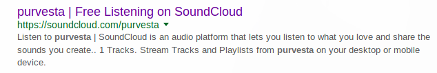
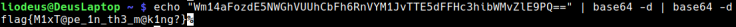

# Reference

[//]: <> (文章所涉及到的技术点、WriteUp的链接)

https://theflagisnothere.wordpress.com/2018/02/28/neverlan-ctf-2018-purvestas-recon/

# Title

[//]: <> (题目)

Purvesta's Recon

Rumor has it purvesta likes to make rap songs in his down time...find it, and you may just find the flag!

# Content

[//]: <> (WriteUp内容)

So we are searching something related to music. Let’s do some google :

I found this, it might be what we are looking for !

We have two tracks but one have rap in his name let’s click on it :

https://soundcloud.com/purvesta/the_gettysburg_address_rap

We found some base64 text, decode it and you got the flag :

