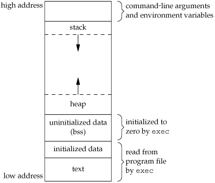

# Reference

[//]: <> (文章所涉及到的技术点的链接)

https://dhavalkapil.com/blogs/Buffer-Overflow-Exploit/

<!--MD5(Buffer Overflow Exploit) = 3e3247d839bdf436cce71b176eae9c67-->

# Title

[//]: <> (题目)

Buffer Overflow Exploit

# Content

[//]: <> (内容)

## Introduction

I am interested in exploiting binary files. The first time I came across the ```buffer overflow``` exploit, I couldn’t actually implement it. Many of the existing sources on the web were outdated(worked with earlier versions of gcc, linux, etc). It took me quite a while to actually run a vulnerable program on my machine and exploit it.

I decided to write a simple tutorial for beginners or people who have just entered the field of binary exploits.

>What will this tutorial cover?

This tutorial will be very basic. We will simply exploit the buffer by smashing the stack and modifying the return address of the function. This will be used to call some other function. You can also use the same technique to point the return address to some custom code that you have written, thereby executing anything you want(perhaps I will write another blog post regarding shellcode injection).

>Any prerequisites?

1. I assume people to have basic-intermediate knowledge of C.
1. They should be a little familiar with gcc and the linux command line.
1. Basic x86 assembly language.

>Machine Requirements:

This tutorial is specifically written to work on the latest distro’s of ```linux```. It might work on older versions. Similar is the case for ```gcc```. We are going to create a 32 bit binary, so it will work on both 32 and 64 bit systems.

>Sample vulnerable program:

```C
#include <stdio.h>

void secretFunction()
{
    printf("Congratulations!\n");
    printf("You have entered in the secret function!\n");
}

void echo()
{
    char buffer[20];

    printf("Enter some text:\n");
    scanf("%s", buffer);
    printf("You entered: %s\n", buffer);    
}

int main()
{
    echo();

    return 0;
}
```

Now this programs looks quite safe for the usual programmer. But in fact we can call the  ```secretFunction``` by just modifying the input. There are better ways to do this if the binary is local. We can use ```gdb``` to modify the ```%eip```. But in case the binary is running as a service on some other machine, we can make it call other functions or even custom code by just modifying the input.

>Memory Layout of a C program

Let’s start by first examining the memory layout of a C program, especially the stack, it’s contents and it’s working during function calls and returns. We will also go into the machine registers ```esp```, ```ebp```, etc.

>Divisions of memory for a running process



1. **Command line arguments and environment variables**: The arguments passed to a program before running and the environment variables are stored in this section.

1. **Stack**: This is the place where all the function parameters, return addresses and the local variables of the function are stored. It’s a LIFO structure. It grows downward in memory(from higher address space to lower address space) as new function calls are made. We will examine the stack in more detail later.

1. **Heap**: All the dynamically allocated memory resides here. Whenever we use malloc to get memory dynamically, it is allocated from the heap. The heap grows upwards in memory(from lower to higher memory addresses) as more and more memory is required.

1. **Uninitialized data(Bss Segment)**: All the uninitialized data is stored here. This consists of all global and static variables which are not initialized by the programmer. The kernel initializes them to arithmetic 0 by default.

1. **Initialized data(Data Segment)**: All the initialized data is stored here. This constists of all global and static variables which are initialised by the programmer.

1. **Text**: This is the section where the executable code is stored. The loader loads instructions from here and executes them. It is often read only.