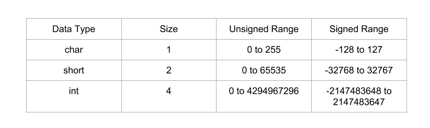

# Reference

[//]: <> (文章所涉及到的技术点的链接)

<!--MD5(Integer Overflow) = f223ecbf45f65f00685e2a59d485c5ee -->

# Title

[//]: <> (题目)

Integer Overflow

# Content

[//]: <> (内容)

VM Setup: Ubuntu 12.04 (x86)

## What is Integer Overflow?

Storing a value greater than maximum supported value is called integer overflow. Integer overflow on its own doesnt lead to arbitrary code execution, but an integer overflow might lead to stack overflow or heap overflow which could result in arbitrary code execution. In this post I will be talking ONLY about integer overflow leading to stack overflow, integer overflow leading to heap overflow will be covered up later in a separate post.

Data types size and its range:

<div align=center></div>

When we try to store a value greater than maximum supported value, our value gets wrapped around. For example when we try to store 2147483648 to signed int data type, its gets wrapped around and stored as -21471483648. This is called integer overflow and this overflow could lead to arbitrary code execution!!

## Integer underflow

Similarly storing a value lesser than the minimum supported value is called integer underflow. For example when we try to store -2147483649 to signed int data type, its gets wrapped around and stored as 21471483647. This is called integer underflow. Here I will be talking only about integer overflow, but the procedure remains same for underflows too!!

Vulnerable Code:
```C
//vuln.c
#include <stdio.h>
#include <string.h>
#include <stdlib.h>

void store_passwd_indb(char* passwd) {
}

void validate_uname(char* uname) {
}

void validate_passwd(char* passwd) {
 char passwd_buf[11];
 unsigned char passwd_len = strlen(passwd); /* [1] */ 
 if(passwd_len >= 4 && passwd_len <= 8) { /* [2] */
  printf("Valid Password\n"); /* [3] */ 
  fflush(stdout);
  strcpy(passwd_buf,passwd); /* [4] */
 } else {
  printf("Invalid Password\n"); /* [5] */
  fflush(stdout);
 }
 store_passwd_indb(passwd_buf); /* [6] */
}

int main(int argc, char* argv[]) {
 if(argc!=3) {
  printf("Usage Error:   \n");
  fflush(stdout);
  exit(-1);
 }
 validate_uname(argv[1]);
 validate_passwd(argv[2]);
 return 0;
}
```

Compilation Commands:
```
#echo 0 > /proc/sys/kernel/randomize_va_space
$gcc -g -fno-stack-protector -z execstack -o vuln vuln.c
$sudo chown root vuln
$sudo chgrp root vuln
$sudo chmod +s vuln
```

Line [1] of the above vulnerable program shows us that an integer overflow bug exists. strlen()’s return type is size_t (unsigned int) which gets stored in unsigned char data type. Hence any value greater than maximum supported value of unsigned char leads to integer overflow. Thus when the password length is 261, 261 gets wrapped around and stored as 5 in ‘passwd_len’ variable!! Because of this integer overflow, bounds checking performed at line [2] can be bypassed, thus resulting in stack based buffer overflow!!! And as seen in [this](https://sploitfun.wordpress.com/2015/05/08/classic-stack-based-buffer-overflow/) post, stack based buffer overflow leads to arbitrary code execution.

Before looking into the exploit code, for better understanding, lets disassemble and draw the stack layout for vulnerable code!!