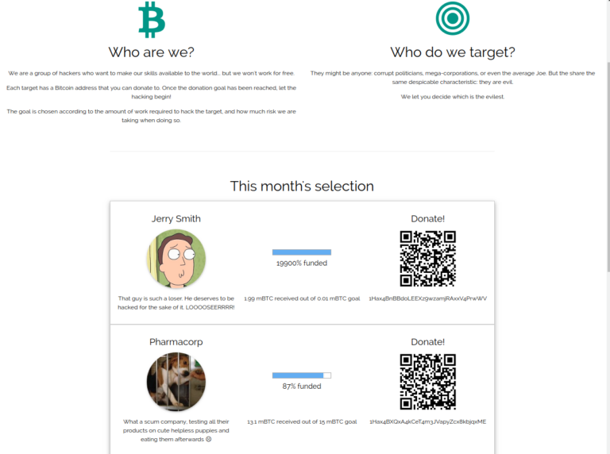
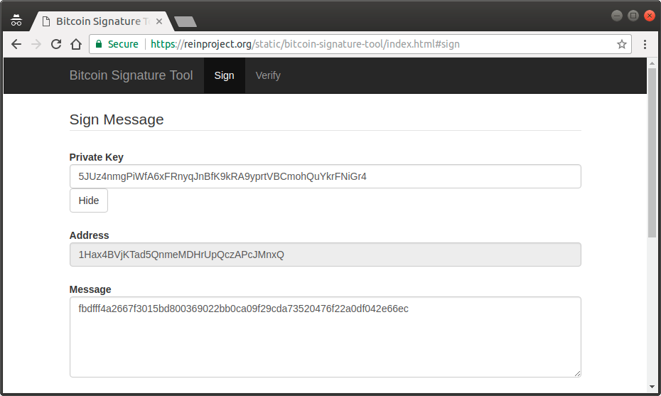
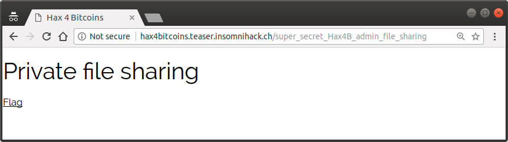

# Reference

[//]: <> (文章所涉及到的技术点、WriteUp的链接)

https://blog.christophetd.fr/write-insomnihack-2018-ctf-teaser/#Hax4Bitcoins

http://lockboxx.blogspot.com/2018/01/insomnihack-teaser-2018-writeup-welcome.html

# Title

[//]: <> (题目)

These crowdfunded hackers are hiding something! http://hax4bitcoins.teaser.insomnihack.ch/

(No need to pay any Bitcoin to solve)

# Content

[//]: <> (WriteUp内容)

I found this challenge interesting, because it wasn’t very technical but still required some thinking.



The website contains several bitcoin addresses, all starting with ```1Hax4B```. In the footer, we can see the mention:

```
PS: we call dibs on all 1Hax4B vanity addresses ò_ó
```

If we inspect these addresses on blockchain.info, we see that [one of them](https://blockchain.info/address/1Hax4B2j9FC3c73jHhfxrPQmv2zKuiSngv) has an output transaction to the address ```1PasteBinXXXXXdWzkucb1XXXXXXdY9fcu```. Sure enough, that leads us to a pastebin at https://pastebin.com/dWzkucb1.

```
—–BEGIN BITCOIN SIGNED MESSAGE—–
Hi dude, I added a login form to our website so that we can remotely share sensitive files :)
It’s at /super_secret_Hax4B_admin_login.
—–BEGIN SIGNATURE—–
1Hax4B2j9FC3c73jHhfxrPQmv2zKuiSngv
HMBMSfQJiE68/9x0qeyIiEkf8T3N8Zt26d6vVBECVNZNJWcdIBk06sCcVNKkETaYDFcKwycnz6eDeAPwQyo9w0w=
—–END BITCOIN SIGNED MESSAGE—–
```

We can see that this message is signed with the bitcoin private key corresponding to the key ```1Hax4B2j9FC3c73jHhfxrPQmv2zKuiSngv```. If we browse to ```/super_secret_Hax4B_admin_login```, we get a login form for an administrative interface.


The challenge is a hash which is unique for each session. If we look at the source of this page, we find what might be an hint.

```html
<p>To access this content, prove that you are an Hax4B admin</p>
<form action="/super_secret_Hax4B_admin_login" method="POST">
<p>Challenge: fbdfff4a2667f3015bd800369022bb0ca09f29cda73520476f22a0df042e66ec</p>
<p>
  Response: 
  <input type="text" name="response" size="96" required="required" pattern="[iVBORw0KGgoAAAANSUh[...]SUVORK5CYII]{87}=">
</p>
<button type="submit">Submit</button>
</form>
```

We can decode the base64 payload and see what it gives us.

```
$ base64 -d hint.b64 > hint.bin
$ file hint.bin 
hint.bin: PNG image data, 18 x 20, 8-bit/color RGBA, non-interlaced
```

We get a tiny image, with something that looks like a hooded man.


No metadata in it, nothing by changing the colors or brightness, no special string in the file, so I’m guessing it’s a false hint. Back to the login page – remember this sentence?
```
PS: we call dibs on all 1Hax4B vanity addresses ò_ó
```
And this message on the login page.
```
To access this content, prove that you are an Hax4B admin
```
Here, I’m going to guess that in order to access the admin interface, we’ll have to sign the challenge with a private key tied to a bitcoin address starting with 1Hax4B.

After a few seconds of googling, I discover that it is quite straightforward to generate a bitcoin address starting with a specific set of bytes. [Vanitygen](https://en.bitcoin.it/wiki/Vanitygen) is a tool which does exactly this.

```
$ ./vanitygen 1Hax4B
Difficulty: 259627881
Pattern: 1Hax4B 
Address: 1Hax4BVjKTad5QnmeMDHrUpQczAPcJMnxQ
Privkey: 5JUz4nmgPiWfA6xFRnyqJnBfK9kRA9yprtVBCmohQuYkrFNiGr4
```

Here we go. Now, we can sign the challenge presented by the admin page using this private key, using an online tool such as [this one](https://reinproject.org/static/bitcoin-signature-tool/index.html).



We get the following.

```
-----BEGIN BITCOIN SIGNED MESSAGE-----
fbdfff4a2667f3015bd800369022bb0ca09f29cda73520476f22a0df042e66ec
-----BEGIN SIGNATURE-----
1Hax4BVjKTad5QnmeMDHrUpQczAPcJMnxQ
HCnFVFPeyzoyzYGTyjhyZ3T7I2zRVhd91gCI9KmVDo0QM9cAWWjNE0Zq3T0T1H2i9uT9nYx9gL9b60hcMu5SlgA=
-----END BITCOIN SIGNED MESSAGE-----
```

We can know input the signature (starting with HCnF...) in the login form, and we get:



Flag: INS{v4n1ty_k1ll3d_th3_c4t}

