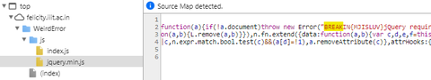

# Reference

[//]: <> (文章所涉及到的技术点、WriteUp的链接)

http://ctf.publog.jp/archives/1069422443.html

# Title

[//]: <> (题目)

Vaneesh wants to learn javascript from Sanukul. But Sanukul is busy with his love Mary. Vaneesh found something weird in the source code. Can you find it too?

https://felicity.iiit.ac.in/WeirdError/

Points: 100

Flag Format: BREAKIN{[0-9A-Za-z_]+}

HINT: Its not pretty, but it is important.

Tags: Misc

# Content

[//]: <> (WriteUp内容)

提示されたURLを表示します。下図のようにゲームらしき画面が表示されます。

jquery.min.jsファイルを見てみると下図のようにフラグが記載されています。

フラグは、
BREAKIN{MJISLUV}
です。