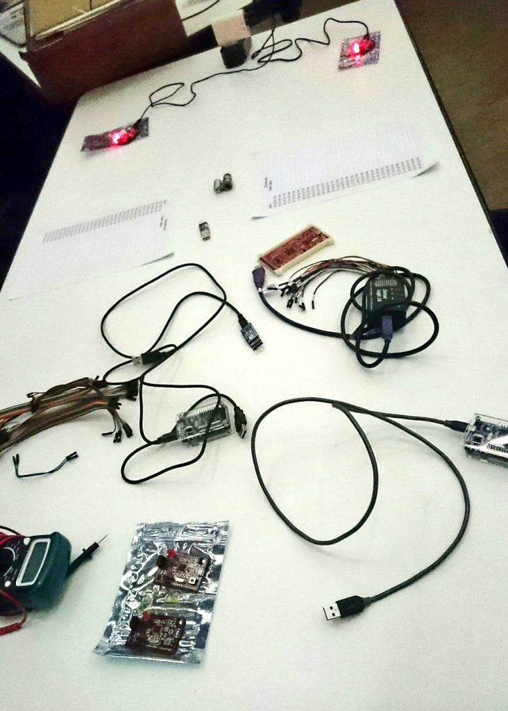
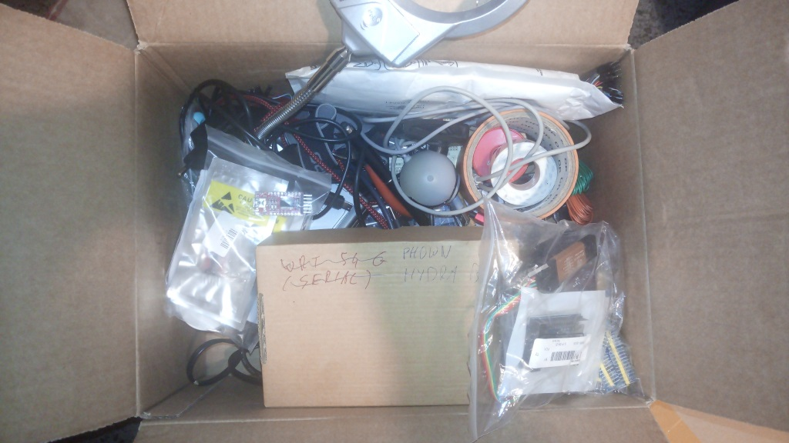
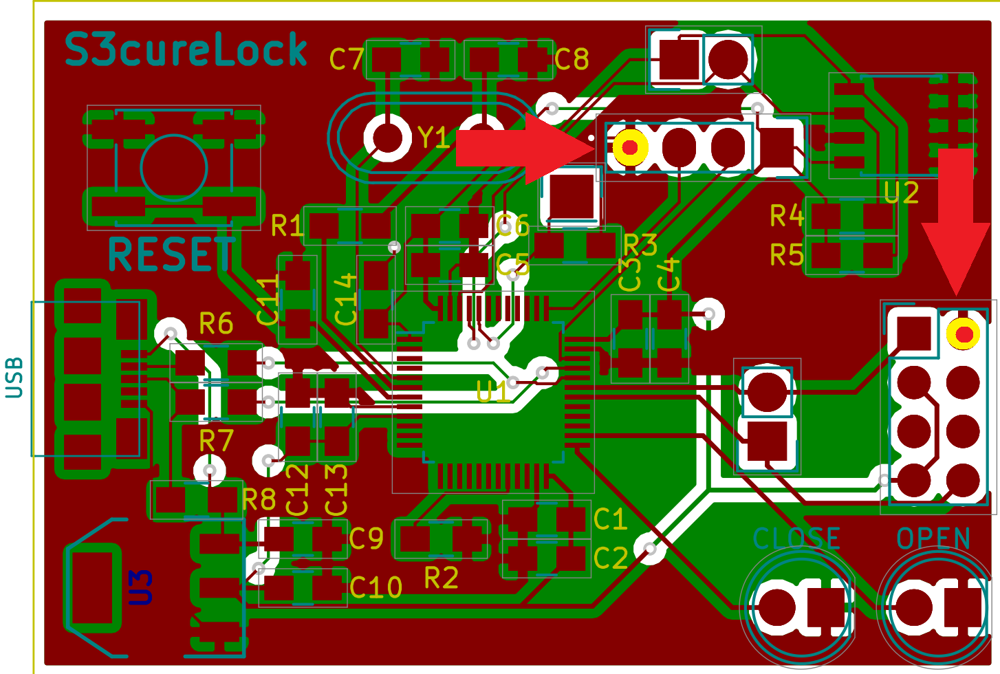
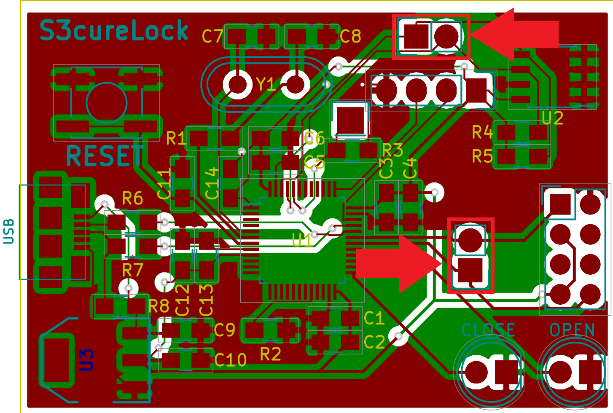

# Reference

[//]: <> (文章所涉及到的技术点、WriteUp的链接)

* https://securimag.org/wp/articles/insomnihack-2018-write-up-s3curlock-level-1-2-3/

# Title

[//]: <> (题目)


# Content

[//]: <> (WriteUp内容)



(photo from Tipi’Hack’s blog)

About the 3 hardware challenges, here is a full write-up. I’ve take extra time to even explain the 2 thirst level for n00b. If you are not in all those electronic stuff, you should have a look at this write-up.

First of all, the very first task is done at home before leaving: you need to pack everything you find useful for a CTF, and it looks like this:



A box full of EEPROM programmer, Arduino, STM32, logical analyzer, iron solder, resistor, LED, cables, multimeter etc. Even if the organizer give you all stuff you need, you are more comfortable with the tools you own/know. And more, you can have good surprise; we’ll see it later ;).

## Level 1

For the first level, it asks you to locate the serial port and to hook your computer on the S3cure board. For this task, a simple USB <-> SERIAL module is enough.

For PIN hunting the process is always the same: you must identify the number of PIN you need to find and spot them on the board. The number of PIN depends on the bus or protocol you want to connect to. For a serial link, 3 PIN are needed, TX, RX and GROUND.

Here, you need to build something like a crossed Ethernet cable: TX-S3cureLock <-> RX-USB-serial and RX-S3cureLock <-> TX-USB-serial (and for sure, the GROUND).

The first thing to do is to locate the GROUND. When you hook electronic stuff to another electronic stuff, without connecting ground together, you risk burning some component :



Then, you need to find TX-S3cureLock. As it’s a 2 PIN connector, here you have 2 groups of 2 PIN. Only 4 possibilities, but you can guess more. 2 PIN are close to an EEPROM and are dedicated to it, so you need to try the other group of PIN first :



Connect the RX-USB-serial PIN and start a terminal at 9600 bauds (the most common), then RESET a few time the S3cureLock to see if something pop on screen. If there is garbage, you’re near done: you just need to guess the good baudrate. If nothing appears, change the PIN and start again to RESET the board.

When TX-S3cureLock is connected to RX-USB-serial, you just need to connect RX-S3cureLock to TX-USB-serial or you won’t be able to send byte to the S3cureLock. The RX-S3cureLock PIN is easy to spot; it’s the one beside the TX-S3cureLock.

When everything is wired as it should, in the terminal the flag pop:

```
INS{1_4m_4_s3r14l_K1lL3r}
 
Enter password :
```

