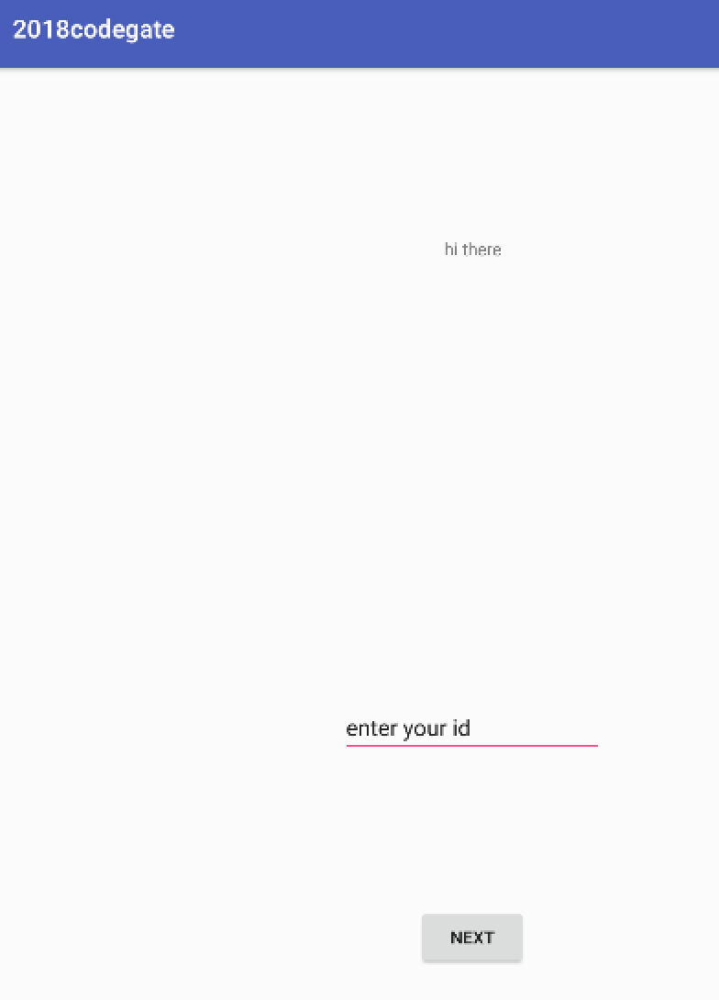
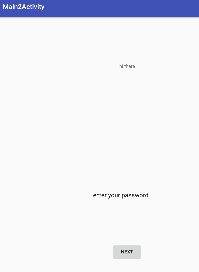
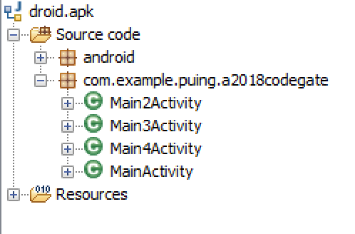
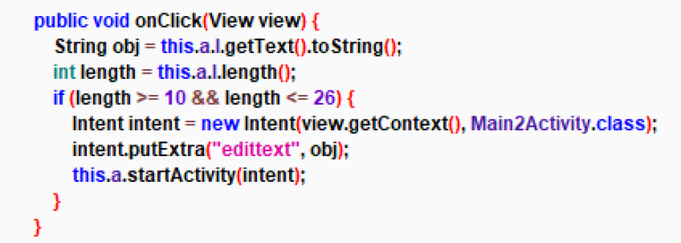
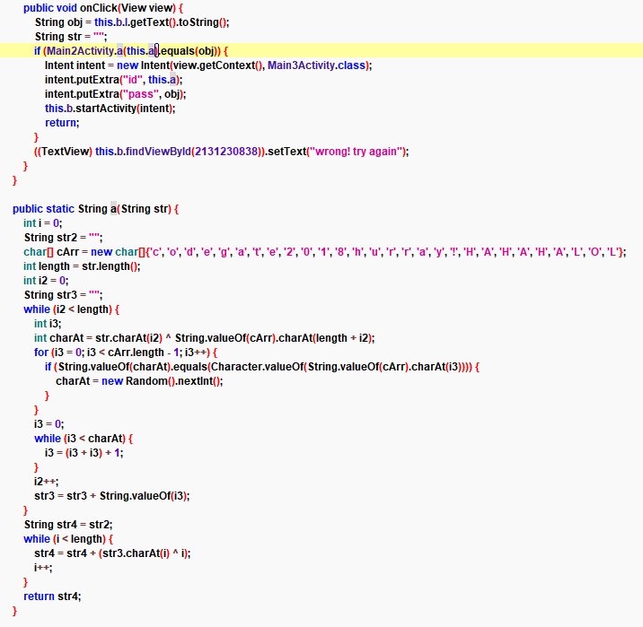
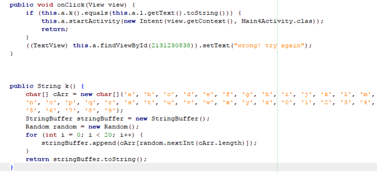
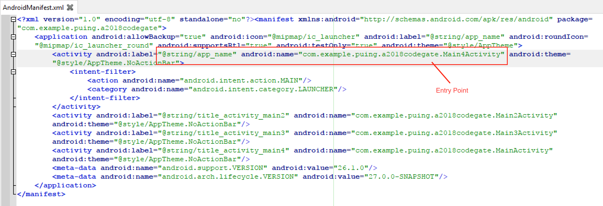
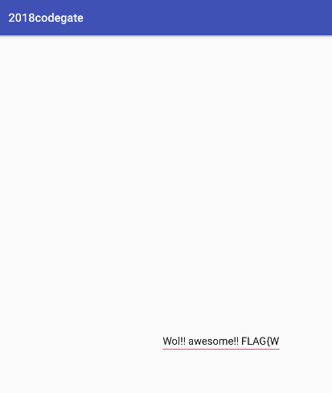

# Reference

[//]: <> (文章所涉及到的技术点、WriteUp的链接)

http://www.wagiro.com/archivos/397

# Title

[//]: <> (题目)

This  test provides us an APK file through this link, called droid.apk.

# Content

[//]: <> (WriteUp内容)

## Analysis

The first thing we do is install it on a genymotion android virtual machine, and execute it:



If we click next, pass to following challenge:



At this stage, if we click, it returns an error message.

Then, we open it with jadx-gui  and analyze it. We see that there are several classes in the com.example.puing.a2018codegatepackage:



These classes give us a hint as to the order in which they are executed, MainActivity-> Main2Activity-> Main3Activity-> Main4Activity, going from one to the other, and finally if we execute Main4Activity, it will show us the flag.

Analyzing each of the functions, you can see the checks they are doing, so, the MainActivity checks that the input has a length between 10 and 26 characters, as shown in the image:



If we go to analyze the Main2Activity we can see a function where checks that the input is equal to the result of executing the “a” function. This function among other things,  performs an XOR.



When the execution is passed to the Main3Activity class, the “k” function is executed. This function gives a random result every time it is executed.



Our conclusion was that it not possible to reach the execution of the Main4Activity class, which supposedly is where the flag is displayed.

## Solution

To solve this challenge what we did was Patch the .apk file, changing the EntryPoint of the program, in AndroidManifest.xml. When the application is executed, it will go directly to execute the Main4Activity class.

These are the steps followed:

1. Decompile the apk file.

```
$ apktool_2.3.1.jar d droid.apk
I: Using Apktool 2.3.1 on droid.apk
I: Loading resource table...
I: Decoding AndroidManifest.xml with resources...
I: Loading resource table from file: /home/user/.local/share/apktool/framework/1.apk
I: Regular manifest package...
I: Decoding file-resources...
I: Decoding values */* XMLs...
I: Baksmaling classes.dex...
I: Copying assets and libs...
I: Copying unknown files...
I: Copying original files...
```
2. Modify AndroidManifest.xml.

```
Change this line:
<activity android:label="@string/app_name" android:name="com.example.puing.a2018codegate.MainActivity" android:theme="@style/AppTheme.NoActionBar">

For this:
<activity android:label="@string/app_name" android:name="com.example.puing.a2018codegate.Main4Activity" android:theme="@style/AppTheme.NoActionBar">


And this other line:
<activity android:label="@string/title_activity_main4" android:name="com.example.puing.a2018codegate.Main4Activity" android:theme="@style/AppTheme.NoActionBar"/>

For this:
<activity android:label="@string/title_activity_main4" android:name="com.example.puing.a2018codegate.MainActivity" android:theme="@style/AppTheme.NoActionBar"/>
```

The result of modify AndroidManifest.xml is this:



3- Reensamble apk.

```
$ apktool b droid/
I: Using Apktool 2.3.1
I: Checking whether sources has changed...
I: Checking whether resources has changed...
I: Building resources...
...
I: Building apk file...
I: Copying unknown files/dir...
```

4-Sign the apk with the key.
```
$ jarsigner -verbose -sigalg SHA1withRSA -digestalg SHA1 -keystore my-release-key.keystore droid.apk alias_name
Enter Passphrase for keystore: 
 adding: META-INF/MANIFEST.MF
 adding: META-INF/ALIAS_NA.SF
 adding: META-INF/ALIAS_NA.RSA
 signing: AndroidManifest.xml
 signing: classes.dex
...
jar signed.
```

5- The apk must be aligned for optimal loading.
```
$ zipalign -v 4 droid.apk droid2.apk
Verifying alignment of droidma.apk (4)...
 50 META-INF/MANIFEST.MF (OK - compressed)
 9251 META-INF/ALIAS_NA.SF (OK - compressed)
 18555 META-INF/ALIAS_NA.RSA (OK - compressed)
 19668 AndroidManifest.xml (OK - compressed)
 20708 classes.dex (OK - compressed)
...
Verification successful
```

Finally, we install droid2.apk in VM genymotion again, and execute it:



The full text is: Wol!! awesome!! FLAG{W3_w3r3_Back_70_$3v3n7een!!!} hahahah!!

Cheers.