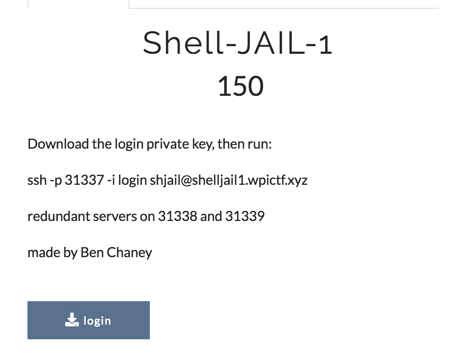
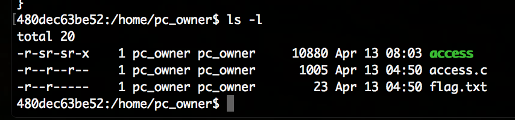
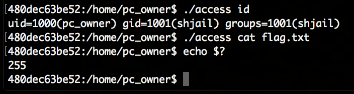
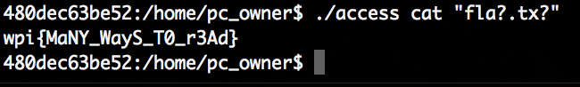

# Reference

[//]: <> (文章所涉及到的技术点、WriteUp的链接)

* https://infosec.rm-it.de/2018/04/15/wpictf-2018-shell-jail-1/
* https://github.com/soolidsnake/Write-ups/tree/master/WPICTF/Shell-JAIL-1
* https://github.com/wr47h/CTF-Writeups/tree/master/2018/WPICTF'18

# Title

[//]: <> (题目)

Download the login private key, then run:

ssh -p 31337 -i login shjail@shelljail1.wpictf.xyz

redundant servers on 31338 and 31339

made by Ben Chaney

"login" file from https://drive.google.com/open?id=1Q_hKH281O0kbwFPhFrtWkWSIHGTlbdHG

# Content

[//]: <> (WriteUp内容)


The [WPICTF](https://ctf.wpictf.xyz/) 2018 “Shell-JAIL-1” challenge:



After downloading the linked private key and connecting to the remote server we are dropped into a limited user account and the directory ```/home/pc_owner```. In that folder there are only 3 files – including ```flag.txt``` to which our user has no access:



The ```access``` file is basically a setuid executable which will run as the ```pc_owner``` user. The source of the executable is also available in access.c (mirror [here](Resource/access.c)). The program will take all arguments and pass it to system() unless it contains blacklisted strings, relevant parts in the source code:

```c
int filter(const char *cmd){
    int valid = 1;
    valid &amp;= strstr(cmd, "*") == NULL;
    valid &amp;= strstr(cmd, "sh") == NULL;
    valid &amp;= strstr(cmd, "/") == NULL;
    valid &amp;= strstr(cmd, "home") == NULL;
    valid &amp;= strstr(cmd, "pc_owner") == NULL;
    valid &amp;= strstr(cmd, "flag") == NULL;
    valid &amp;= strstr(cmd, "txt") == NULL;
    return valid;
}
 
 
int main(int argc, const char **argv){
    setreuid(UID, UID);
    char *cmd = gen_cmd(argc, argv);
    if (!filter(cmd)){
        exit(-1);
    }
    system(cmd);
}
```

This means passing id to it will work but cat flag.txt will not:



Of course circumventing that filter is rather easy, the * wildcard is forbidden, but ? is not. We can use those wildcards to read flag.txt by passing cat "fla?.tx?" to it:



The flag is: wpi{MaNY_WayS_T0_r3Ad}