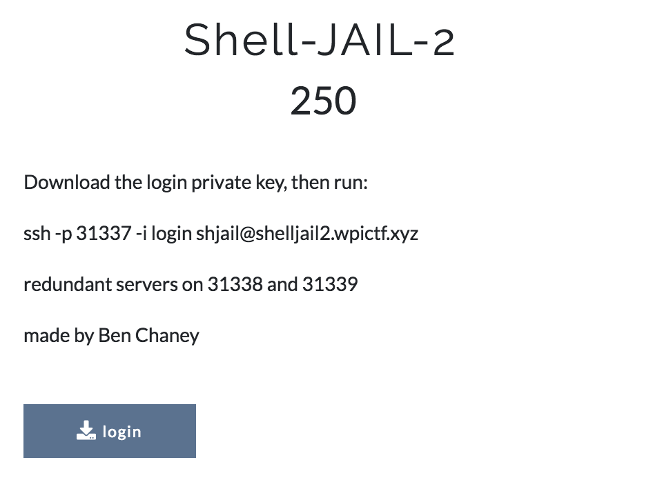
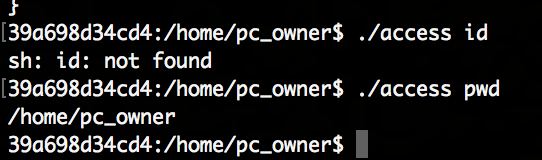
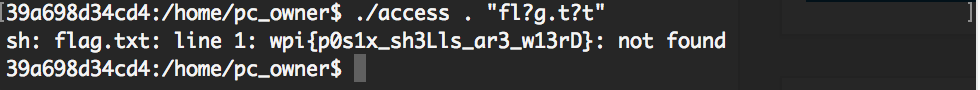

# Reference

[//]: <> (文章所涉及到的技术点、WriteUp的链接)

* https://infosec.rm-it.de/2018/04/15/wpictf-2018-shell-jail-2/
* https://github.com/soolidsnake/Write-ups/tree/master/WPICTF/Shell-JAIL-2
* https://ctftime.org/writeup/9760


# Title

[//]: <> (题目)

Download the login private key, then run:

ssh -p 31337 -i login shjail@shelljail2.wpictf.xyz

redundant servers on 31338 and 31339

made by Ben Chaney

"login" file from https://drive.google.com/open?id=1Q_hKH281O0kbwFPhFrtWkWSIHGTlbdHG

# Content

[//]: <> (WriteUp内容)


The [WPICTF](https://ctf.wpictf.xyz/) 2018 “Shell-JAIL-2” challenge:



This is almost the same challenge as Shell-JAIL-1 (see my write-up [here](https://infosec.rm-it.de/2018/04/15/wpictf-2018-shell-jail-1/) for explanation of details) with the exception of one extra line in access.c (full mirror [here](Resource/access.c)):
```
setenv("PATH", "", 1);
```
This means that before dropping the arguments to system() the $PATH environment variable is unset. Also the blacklist filter of the previous challenge remains the same. With that only built in sh commands will continue to work and since / is also blacklisted we cannot provide full paths to binaries either. For example id will now not work while pwd still executes:

But the . (or source) command still works. With that we can tell the shell to try to execute the flag.txt file and the error message will reveal its content. We still use the ? wildcard to circumvent the other blacklist by passing . "fl?g.t?t" to it:





The flag is: wpi{p0s1x_sh3Lls_ar3_w13rD}