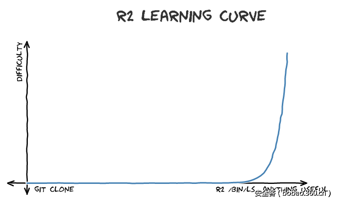
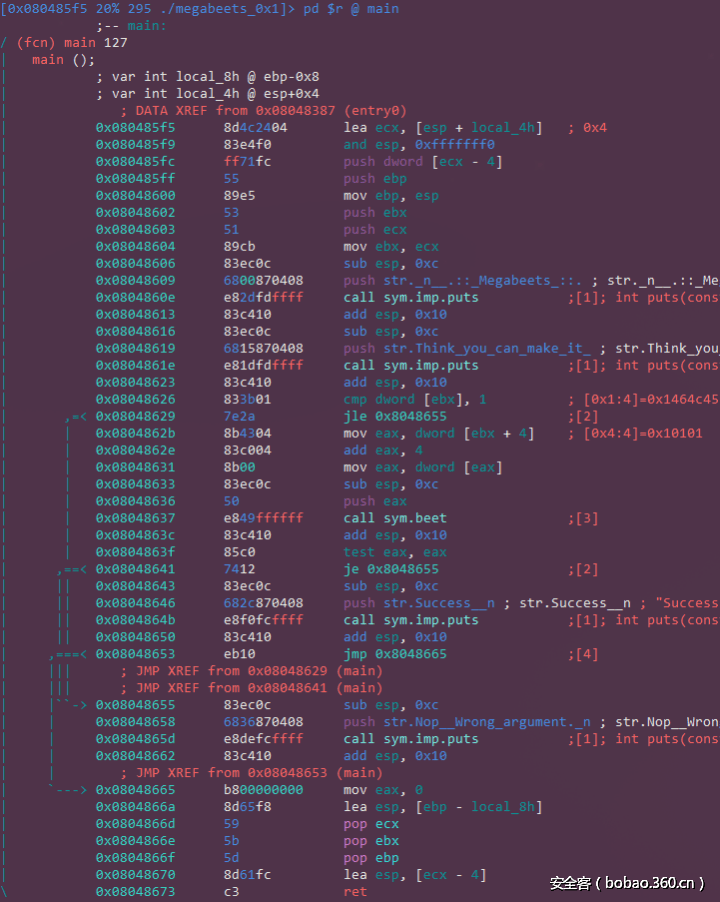
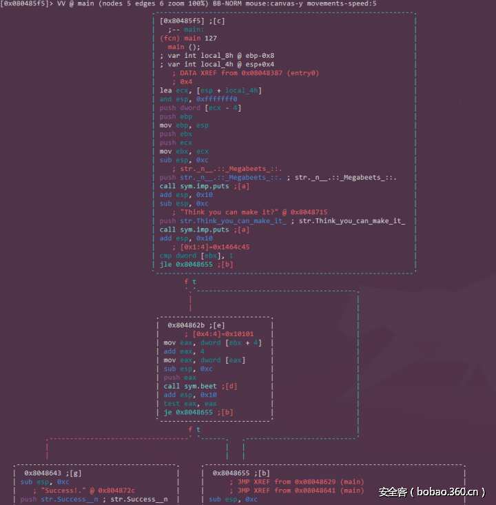

# Reference

[//]: <> (文章所涉及到的技术点的链接)

* https://www.anquanke.com/post/id/86850
* https://www.anquanke.com/post/id/86943
* https://www.megabeets.net/a-journey-into-radare-2-part-1/

<!--MD5( Radare 2之旅：通过crackme实例讲解Radare 2在逆向中的应用（上） ) = 	39315d9e7defe54a437708b9d30d19e6 -->

# Title

[//]: <> (题目)

Radare 2之旅：通过crackme实例讲解Radare 2在逆向中的应用（上）

# Content

[//]: <> (内容)

## 序言

在过去的一年里我研究了 radare2 很久，无论是参加CTF、逆向工程或是漏洞挖掘，我发现 radare2都能很好的提升我的工作效率， 有时候它也是我用来分析恶意软件（如溯源）的工具,不幸的是很少有人听过它，可能是因为大多数人习惯了使用 IDA Pro，OllyDBG, gdb,不管怎样，我都觉得 radare2 应该成为你工具箱中的一部分.

因为我真的特别喜欢这个项目，因此为了让大家能更好的了解并使用它，我决定专门创建一个有关 r2 系列的文章来介绍它的特点和功能，希望能让大家更好的利用它去解决工作中的问题.


## radare2

radare2是一个开源的逆向工程和二进制分析框架，它的强大超出你的想象，包括反汇编、分析数据、打补丁、比较数据、搜索、替换、虚拟化等等，同事具备超强的脚本加载能力，它可以运行在几乎所有主流的平台（GNU/Linux, .Windows *BSD, iOS, OSX, Solaris…）并且支持很多的cpu架构以及文件格式，我认为所有它的这些特征恰好能表达出一个意思–那就是给予你的使用以极大的自由.

radare2工程是由一系列的组件构成，这些组件可以在 radare2 界面或者单独被使用–比如我们将要了解的rahash2, rabin2, ragg2三个组件，所有这些组件赋予了 radare2 强大的静态或动态分析、十六进制编辑以及溢出漏洞挖掘的能力.

在这之前，我们有必要知道学习使用 radare2 是一个比较艰难的过程，尽管它有直观的GUI界面，但坦白的说，它确实没有IDA用起来方便，它的学习曲线我认为大致是这样的



当然我们不用因为它很复杂就退怯，我会竭尽所能让每个知识点都更清晰易懂!

在开始前，你可以在[这儿](http://rada.re/r/cmp.html)去了解我们当前正面对并试图解决的问题.

这里是有关 radare2 最新的介绍文章

 Check it out @ https://t.co/MybNPqq2CH@radareorg#radare2

— Itay Cohen (@Megabeets_Blog) March 27, 2017

## 获得radare2

### 安装

因为 我们每天都在更新Radare2的开发，因此建议你使用最新的github版本，不要使用 stable版，因为有时候 stable版可能还没有 最新的 github 版稳定.

```
$ git clone https://github.com/radare/radare2.git
$ cd radare2
$ ./sys/install.sh
```
如果你不想使用github版，或者想要每个平台相对应的二进制文件，那就点击这里去下载吧！[download page at the radare2 website](http://radare.org/r/down.html).

### 更新

正如我之前所说，我极力推荐你使用github上的最新版，如果你需要更新，那就太简单了，只需要下面这条命令,我每天习惯在早上更新一下 radare2 ，在这期间，你可以去喝杯咖啡..

```
$ ./sys/install.sh
```

### 卸载

oh…说实话我实在想不到任何理由，你会在看这篇文章的时候需要去卸载  radare2 ，哈哈，不过如果你随时需要，那就这样吧

```
$ make uninstall
$ make purge
```

下面正式进入正题，let's go…

这里是crackme的下载地址[here](https://github.com/ITAYC0HEN/A-journey-into-Radare2/blob/master/Part%201%20-%20Simple%20crackme/megabeets_0x1)

好的，现在假设你们已经安装好 radare2 ，crackme 文件也已经下载到机器上，我现在开始介绍 radare2 的基本用法，我将在 [Remnux](https://remnux.org/) 系统上进行操作，但是大多数命令和说明在 windows或者其他系统上都一样的.

## 命令行参数

正如大多数软件的使用一样，最好的了解它的方式就是在它后面加一个 -h 参数
```
r2 -h
```

在这里我不会展示它所有的用法，我只会展示平常我使用的比较多并且很重要的参数:

```
Usage: r2 [-ACdfLMnNqStuvwz] [-P patch] [-p prj] [-a arch] [-b bits] [-i file]
          [-s addr] [-B baddr] [-M maddr] [-c cmd] [-e k=v] file|pid|-|--|=
  
-d: Debug the executable 'file' or running process 'pid'
-A: Analyze executable at load time (xrefs, etc)
-q: Quiet mode, exit after processing commands
-w: Write mode enabled
-L: List of supported IO plugins
-i [file]: Interprets a r2 script
-n: Bare load. Do not load executable info as the entrypoint
-c 'command; command; ...': Run r2 and execute commands (eg: r2 's main; px 60')
-p [prj]: Creates a project for the file being analyzed
-: Opens r2 with the malloc plugin that gives a 512 bytes memory area to play with
```

### 二进制信息

当我拿到一个二进制文件，首先就会去获取它的基本信息，这里将会用到 r2 框架里最强的一个工具 ：rabin2.

rabin2 可以获取包括ELF, PE, Mach-O, Java CLASS文件的区段、头信息、导入导出表、字符串相关、入口点等等，并且支持几种格式的输出文件.

使用下面的命令获取更多的用法

```
man rabin2
```

我们可以通过 -I 参数 来让 rabin2 打印出二进制文件的系统属性、语言、字节序、框架、以及使用了哪些 加固技术（canary, pic, nx）.

```
$ rabin2 -I megabeets_0x1
havecode true
pic      false
canary   false
nx       false
crypto   false
va       true
intrp    /lib/ld-linux.so.2
bintype  elf
class    ELF32
lang     c
arch     x86
bits     32
machine  Intel 80386
os       linux
minopsz  1
maxopsz  16
pcalign  0
subsys   linux
endian   little
stripped false
static   false
linenum  true
lsyms    true
relocs   true
rpath    NONE
binsz    6220
```

这里你可以清晰地看到这是一个32位的 elf 文件，没有剥离符号表并且是动态链接的，它没有使用溢出隔离技术-这对于下一篇我们利用 radare2 去溢出它是很有利的信息，现在我们来运行它看看这个程序到底做了啥。

注意：尽管我让你们直接运行，但建议任何时候对一个不清楚的二进制文件都不要直接运行，最好放在一个隔离的环境，比如虚拟机下运行！

```
$ ./megabeets_0x1
 
  .:: Megabeets ::.
Think you can make it?
Nop, Wrong argument.
 
$ ./megabeets_0x1 abcdef
 
  .:: Megabeets ::.
Think you can make it?
Nop, Wrong argument.
```

开始来我们需要给它一些参数，这里输入 "abcdef"，然后还是错了，很明显，我们需要给它密码，这就是这次crackme要做的事.

下面我们用 radare2来测试这个程序：
```
$ r2 ./megabeets_0x1
 — Thank you for using radare2. Have a nice night!
[0x08048370]>
```

当我们运行它的时候，它会给我们一个欢迎界面，同时给我们一个shell操作符，在这里有很多有趣和有用的命令，现在 r2 在等我们给它下一步的命令，当前它输出了一个地址 (0x08048370)，这就是它自动识别的程序入口点，我们来验证一下：

```
[0x08048370]> ie
[Entrypoints]
vaddr=0x08048370 paddr=0x00000370 baddr=0x08048000 laddr=0x00000000 haddr=0x00000018 type=program1 entrypoints
```

我们用 ie 命令可以打印出程序的入口点， ie 的意思就是 info >> entrypoint，是不是很好记，当然我们不需要刻意去记住它，因为我们可以在任何一个命令后面添加 ? 来获得更多的子命令信息：

```
[0x08048370]> i?
|Usage: i Get info from opened file (see rabin2’s manpage)
| Output mode:
| ‘*’                Output in radare commands
| ‘j’                Output in json
| ‘q’                Simple quiet output
| Actions:
| i|ij               Show info of current file (in JSON)
| iA                 List archs
| ia                 Show all info (imports, exports, sections..)
| ib                 Reload the current buffer for setting of the bin (use once only)
| ic                 List classes, methods and fields
| iC                 Show signature info (entitlements, …)
| id                 Debug information (source lines)
| iD lang sym        demangle symbolname for given language
| ie                 Entrypoint
| iE                 Exports (global symbols)
| ih                 Headers (alias for iH)
| iHH                Verbose Headers in raw text
| ii                 Imports
| iI                 Binary info
| ik [query]         Key-value database from RBinObject
| il                 Libraries
| iL                 List all RBin plugins loaded
| im                 Show info about predefined memory allocation
| iM                 Show main address
| io [file]          Load info from file (or last opened) use bin.baddr
| ir|iR              Relocs
| is                 Symbols
| iS [entropy,sha1]  Sections (choose which hash algorithm to use)
| iV                 Display file version info
| iz                 Strings in data sections
| izz                Search for Strings in the whole binary
| iZ                 Guess size of binary program
```

i 开头的命令主要是用来获取各种信息。

## 分析

radare2 不会主动去分析一个文件，因为这样做的代价太大了，它需要花费很多的时间，尤其是大文件，有关分析的操作或者设置启动时不分析可以去 radare2 的博客看看 [this post](http://radare.today/posts/analysis-by-default/).

当然分析是一个必要的功能，r2 也提供了很多与之相关的功能，就像之前说的，我们可以在 'a' 后面加 '?' 来探索这个系列的命令：

```
[0x08048370]> a?
|Usage: a[abdefFghoprxstc] […]
| ab [hexpairs]    analyze bytes
| abb [len]        analyze N basic blocks in [len] (section.size by default)
| aa[?]            analyze all (fcns + bbs) (aa0 to avoid sub renaming)
| ac[?] [cycles]   analyze which op could be executed in [cycles]
| ad[?]            analyze data trampoline (wip)
| ad [from] [to]   analyze data pointers to (from-to)
| ae[?] [expr]     analyze opcode eval expression (see ao)
| af[?]            analyze Functions
| aF               same as above, but using anal.depth=1
| ag[?] [options]  output Graphviz code
| ah[?]            analysis hints (force opcode size, …)
| ai [addr]        address information (show perms, stack, heap, …)
| ao[?] [len]      analyze Opcodes (or emulate it)
| aO               Analyze N instructions in M bytes
| ar[?]            like ‘dr’ but for the esil vm. (registers)
| ap               find prelude for current offset
| ax[?]            manage refs/xrefs (see also afx?)
| as[?] [num]      analyze syscall using dbg.reg
| at[?] [.]        analyze execution traces
Examples:
f ts @ S*~text:0[3]; f t @ section..text
f ds @ S*~data:0[3]; f d @ section..data
.ad t t+ts @ d:ds
```

通常我会使用 'aa' 命令来分析文件，当然使用 'aa?'可以获得更多的用法，这里由于文件很小的原因，我选择用 'aaa' 来尽可能的分析出更多更细致的信息，当然你也可以在运行 radare2的使用 -A 参数来直接分析一个文件(例如 r2 -A megabeets_0x1)

```
[0x08048370]> a?
[x] Analyze all flags starting with sym. and entry0 (aa)
[0x08048370]> aaa
[x] Analyze all flags starting with sym. and entry0 (aa)
[x] Analyze len bytes of instructions for references (aar)
[x] Analyze function calls (aac)
[*] Use -AA or aaaa to perform additional experimental analysis.
[x] Constructing a function name for fcn.* and sym.func.* functions (aan)
```

### Flags

分析完成之后， r2会将所有有用的信息和特定的名字绑定在一起，比如区段、函数、符号、字符串，这些都被称作 'flags', flags 被整合进 <flag spaces>，一个 flag 是所有类似特征的集合，展示所有的 flag ，用 'fs' 命令：

```
[0x08048370]> fs
0    4 . strings
1   35 . symbols
2   82 . sections
3    5 . relocs
4    5 . imports
5    1 . functions
```

我们可以使用 'fs <flagspaces>' 加 'f' 来打印出 这个 flags 下面包含的信息，使用分号来间隔多条命令(‘cmd1;cmd2;cmd3;…’).

```
[0x08048370]> fs imports; f
0x08048320 6 sym.imp.strcmp
0x08048330 6 sym.imp.strcpy
0x08048340 6 sym.imp.puts
0xffffffff 16 loc.imp.__gmon_start__
0x08048350 6 sym.imp.__libc_start_main
```

我们看到 r2 列出了这个二进制文件的导出表–熟悉的 ‘strcmp’, ‘strcpy’, ‘puts’,等函数，并和它们的真实地址相关联，同样我们可以列出 字符串 flagspace:

### Strings

我们看到 r2 标记出了 字符串的偏移地址、变量名.现在我们来看看字符串吧，这里有几种方式可以查看文件的字符串，你可以根据自己的需要来选择.

iz – 列出数据段里的字符串

izz – 在整个二进制文件中搜索字符串.

```
[0x08048370]> iz
vaddr=0x08048700 paddr=0x00000700 ordinal=000 sz=21 len=20 section=.rodata type=ascii string=n .:: Megabeets ::.
vaddr=0x08048715 paddr=0x00000715 ordinal=001 sz=23 len=22 section=.rodata type=ascii string=Think you can make it?
vaddr=0x0804872c paddr=0x0000072c ordinal=002 sz=10 len=9 section=.rodata type=ascii string=Success!n
vaddr=0x08048736 paddr=0x00000736 ordinal=003 sz=22 len=21 section=.rodata type=ascii string=Nop, Wrong argument.n
```

还记得吗，在之前运行程序的时候就见过这些字符串了，看到 ‘success’ 了没，它可能就是我们最终成功后想要见到的字符串，现在我们知道了这个字符串的名字，那我们来看看在哪里调用了它：

```
[0x08048370]> axt @@ str.*
data 0x8048609 push str._n__.::_Megabeets_::. in main
data 0x8048619 push str.Think_you_can_make_it_ in main
data 0x8048646 push str._n_tSuccess__n in main
data 0x8048658 push str._n_tNop__Wrong_argument._n in main
```

这条命令又给我们展示了另一个 r2 的功能，'axt' 命令用来在 data/code段里找寻某个地址相关的引用（更多的操作，请看 'ax?'）.'@@'就像一个迭代器，用来在地址空间里不断地匹配后面一系列相关的命令（更多操作，请看 '@@?'）， 'str.*' 是一个通配符，用来标记所有以 'str.'开头的信息，这个不光会列出字符串标志，同时也包括函数名，找到它们到底在哪里以及何处被调用。

### 定位（Seeking）

之前介绍过，r2分析完一个程序后会停留在入口点，现在是时候去其他地方看看了，刚刚看到我们所感兴趣的字符串都是在 'main' 这个函数里被调用的，因此我们用'seek' 命令跳转过去，在 r2 里，它的指令是 's' ,当然你仍然可以用在它后面添加 '?' 的方式来查看它所有可能的用法，根据你的需要选择吧：
```
[0x08048370]> s?
|Usage: s  # Seek commands
| s                 Print current address
| s addr            Seek to address
| s-                Undo seek
| s- n              Seek n bytes backward
| s–                Seek blocksize bytes backward
| s+                Redo seek
| s+ n              Seek n bytes forward
| s++               Seek blocksize bytes forward
| s[j*=]            List undo seek history (JSON, =list, *r2)
| s/ DATA           Search for next occurrence of ‘DATA’
| s/x 9091          Search for next occurrence of x90x91
| s.hexoff          Seek honoring a base from core->offset
| sa [[+-]a] [asz]  Seek asz (or bsize) aligned to addr
| sb                Seek aligned to bb start
| sC[?] string      Seek to comment matching given string
| sf                Seek to next function (f->addr+f->size)
| sf function       Seek to address of specified function
| sg/sG             Seek begin (sg) or end (sG) of section or file
| sl[?] [+-]line    Seek to line
| sn/sp             Seek next/prev scr.nkey
| so [N]            Seek to N next opcode(s)
| sr pc             Seek to register
```

seek 命令通常是接受一个地址或者数学表达式作为参数，这个表达式可以是操作指令、标志位、或者内存操作相关，现在我们想查找 main 函数，因此我们使用 's main' 指令就可以了，不过在这之前我们可以先看看 r2 到底为我们分析出了哪些函数，因此我们用 'afl' 指令，这个指令代表着分析函数列表（Analyze Functions List）.

```
[0x08048370]> afl
0x080482ec    3 35           sym._init
0x08048320    1 6            sym.imp.strcmp
0x08048330    1 6            sym.imp.strcpy
0x08048340    1 6            sym.imp.puts
0x08048350    1 6            sym.imp.__libc_start_main
0x08048360    1 6            sub.__gmon_start___252_360
0x08048370    1 33           entry0
0x080483a0    1 4            sym.__x86.get_pc_thunk.bx
0x080483b0    4 43           sym.deregister_tm_clones
0x080483e0    4 53           sym.register_tm_clones
0x08048420    3 30           sym.__do_global_dtors_aux
0x08048440    4 43   -> 40   sym.frame_dummy
0x0804846b   19 282          sym.rot13
0x08048585    1 112          sym.beet
0x080485f5    5 127          main
0x08048680    4 93           sym.__libc_csu_init
0x080486e0    1 2            sym.__libc_csu_fini
0x080486e4    1 20           sym._fini
```

漂亮，在这里我们看到了之前看到过的导入函数，同时还有入口点，导入库，主函数和两个引起我们兴趣的函数：'sym.beet' 和 'sym.rot13'.

### 反汇编（Disassembling）

主函数

是时候去看看反汇编代码了，首先我们用 's main'  指令定位到main函数入口处，然后用 'pdf'（输出反汇编代码）

注意：就像我之前说过的，这系列文章的主要目的是去让大家了解并学习 r2 的，而不是去教大家如何阅读或者理解反汇编代码，所以在这里我不会刻意的去逐条解释每句代码的意思！事实上这些汇编代码只要有基础的汇编知识我相信都是很容易看懂的.

```
[0x08048370]> s main
[0x080485f5]> pdf
          ;– main:
/ (fcn) main 127
|   main ();
|           ; var int local_8h @ ebp-0x8
|           ; var int local_4h @ esp+0x4
|              ; DATA XREF from 0x08048387 (entry0)
|           0x080485f5      8d4c2404       lea ecx, [esp + local_4h]   ; 0x4
|           0x080485f9      83e4f0         and esp, 0xfffffff0
|           0x080485fc      ff71fc         push dword [ecx – 4]
|           0x080485ff      55             push ebp
|           0x08048600      89e5           mov ebp, esp
|           0x08048602      53             push ebx
|           0x08048603      51             push ecx
|           0x08048604      89cb           mov ebx, ecx
|           0x08048606      83ec0c         sub esp, 0xc
|           0x08048609      6800870408     push str._n__.::_Megabeets_::. ; str._n__.::_Megabeets_::.
|           0x0804860e      e82dfdffff     call sym.imp.puts          ; int puts(const char *s)
|           0x08048613      83c410         add esp, 0x10
|           0x08048616      83ec0c         sub esp, 0xc
|           0x08048619      6815870408     push str.Think_you_can_make_it_ ; “Think you can make it?” @ 0x8048715
|           0x0804861e      e81dfdffff     call sym.imp.puts          ; int puts(const char *s)
|           0x08048623      83c410         add esp, 0x10
|           0x08048626      833b01         cmp dword [ebx], 1          ; [0x1:4]=0x1464c45
|       ,=< 0x08048629      7e2a           jle 0x8048655
|       |   0x0804862b      8b4304         mov eax, dword [ebx + 4]    ; [0x4:4]=0x10101
|       |   0x0804862e      83c004         add eax, 4
|       |   0x08048631      8b00           mov eax, dword [eax]
|       |   0x08048633      83ec0c         sub esp, 0xc
|       |   0x08048636      50             push eax
|       |   0x08048637      e849ffffff     call sym.beet
|       |   0x0804863c      83c410         add esp, 0x10
|       |   0x0804863f      85c0           test eax, eax
|      ,==< 0x08048641      7412           je 0x8048655
|      ||   0x08048643      83ec0c         sub esp, 0xc
|      ||   0x08048646      682c870408     push str.Success__n ; “Success!.” @ 0x804872c
|      ||   0x0804864b      e8f0fcffff     call sym.imp.puts          ; int puts(const char *s)
|      ||   0x08048650      83c410         add esp, 0x10
|     ,===< 0x08048653      eb10           jmp 0x8048665
|     |||      ; JMP XREF from 0x08048629 (main)
|     |||      ; JMP XREF from 0x08048641 (main)
|     |-> 0x08048655      83ec0c         sub esp, 0xc
|     |     0x08048658      6836870408     push str.Nop__Wrong_argument._n ; “Nop, Wrong argument..” @ 0x8048736
|     |     0x0804865d      e8defcffff     call sym.imp.puts          ; int puts(const char *s)
|     |     0x08048662      83c410         add esp, 0x10
|     |        ; JMP XREF from 0x08048653 (main)
|     `—> 0x08048665      b800000000     mov eax, 0
|           0x0804866a      8d65f8         lea esp, [ebp – local_8h]
|           0x0804866d      59             pop ecx
|           0x0804866e      5b             pop ebx
|           0x0804866f      5d             pop ebp
|           0x08048670      8d61fc         lea esp, [ecx – 4]
           0x08048673      c3             ret
```

这些汇编代码大致的意思可以通过下面这个c 代码来解释：

```
if (argc > 1 && beet(argv[1]) == true) 
# i.e - if any argument passed to the program AND the result of beet, given the passed argument, is true
# argc is the number of arguments passed to the program
# argc will be at least 1 becuase the first argument is the program name
# argv is the aray of parameters passed to the program
{
    print "success"
}
else
{ 
     print "fail"
} 
exit
```

## 视图模式 & 图形模式（Visual Mode & Graph Mode）

radare2 具有非常强和高效率的组件用来提供十分友好的视图模式，这也将 r2 的强大带入到了一个新的高度.按 V 键将开启视图模式，按 p/P 可以在不同的模式之间切换，在屏幕的顶部就是你输入的命令，这里使用 p 命令先切换回之前的反编译模式.



视图模式下基本的命令：

移动

你可以使用 k 和 j 来 上下移动，按回车键将在 call 和 jmp 的时候跳转到目的地址，同时上图里你能看到有一些方括号里面有数字，你可以直接在键盘上按相应的数字就会跳转到对应的函数和地址处 ！

帮助

在使用 r2 的任何阶段，你都可以按 ?来调出帮助画面，这能帮助你更好的使用 r2 .

交叉引用

x / X 可以列出当前函数的引用状况，之后再输入相应的数字就可以跳转到指定的引用处了.

## radare2 命令解释器

使用 :command 命令来执行你想要的 r2 命令.

注释

通过 ;[-] 来添加相应的注释

标记

m<key> 可以用来标记特定的偏移地址，之后输入对应的key就可以跳转到你设置的地方.

退出

按 q 返回到 r2 的 shell操作界面.

可视图形模式

在反汇编中经常会用到的就是 图形视图， r2也提供了这个功能，你可以在 shell 里输入 VV来进入图形模式, h / j / k / l 分别表示 左 / 下 / 上 / 右 ,输入 g来跳转到你想去的函数地址.



使用 '?' 可以列出所有可用的命令，提醒下 R 命令挺不错.

