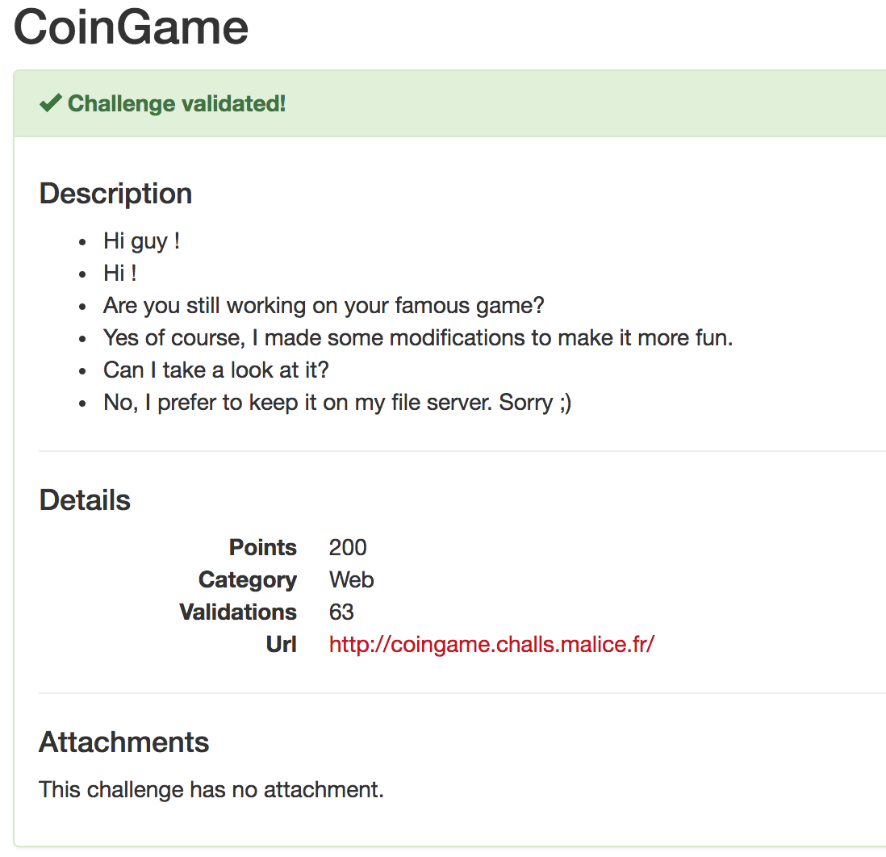
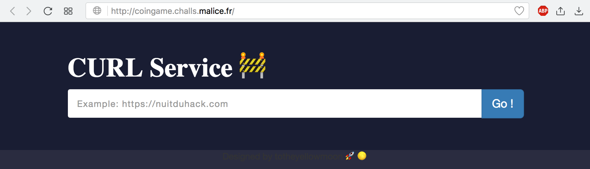
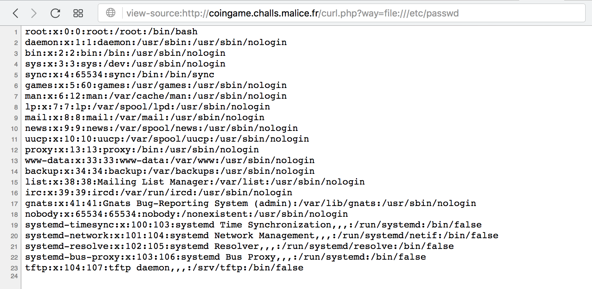
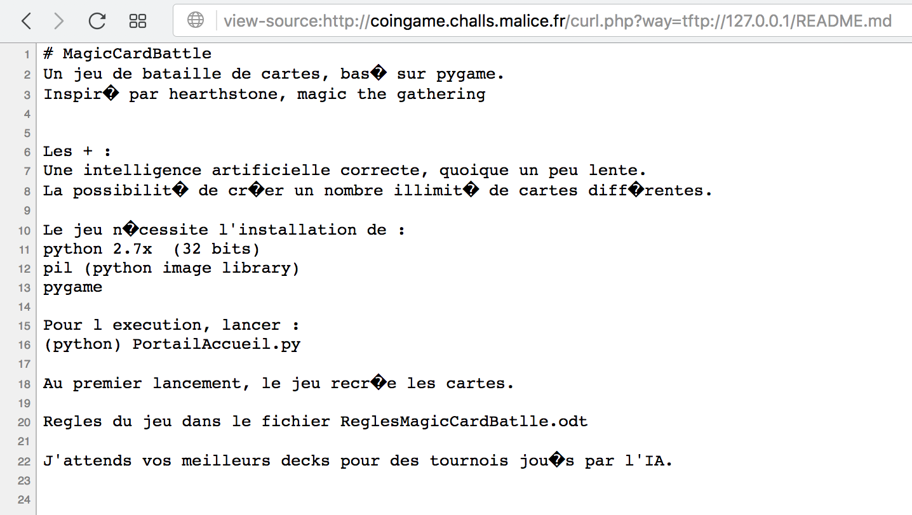
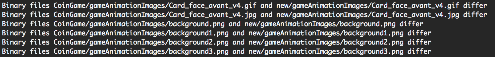
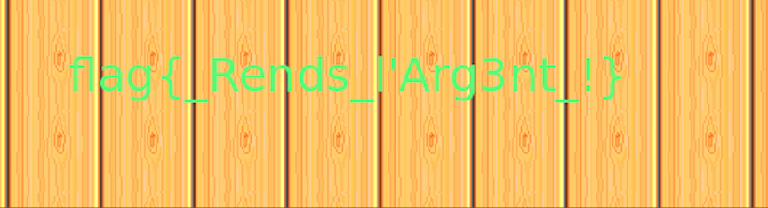

# Reference

[//]: <> (文章所涉及到的技术点、WriteUp的链接)


# Title

[//]: <> (题目)



# Content

[//]: <> (WriteUp内容)

The URL presented us basically only with a simple webform, which fetches a resource we can specify via cURL:



After a bit of trying, we figured out that ```file:///``` URLs also work, like ```file:///etc/passwd```



Fetching a lot of files from the server yielded not a lot of success. After a while we noticed the text on the main site: “DESIGNED BY TOTHEYELLOWMOON”

Searching for this and CoinGame a GitHub repo was found: https://github.com/totheyellowmoon/CoinGame
The description of that repo read: “Congrats it was the first step ! Welcome on my Github, this is my new game but I haven’t pushed the modifications …”

From the description of the challenge and the GitHub repo we gather that “CoinGame” is being developed on this server and some changes aren’t pushed yet to the repo.
From /etc/passwd and /var/log/dpkg.log on the server we’ve also figured out that probably a tftp server is running on that system.

Requesting http://coingame.challs.malice.fr/curl.php?way=tftp://127.0.0.1/README.md we found the local repository:



Next we cloned the public GitHub repo, with that we had a list of all existing files in the repository. We looped over all the files and downloaded them via tftp from the system. Then simply ran a diff on the checkout and downloaded files. None of the code had any differences, but a few pictures didn’t match:



In any of the ```gameAnimationImages/background*.png``` images the flag was visible:



The flag was: flag{_Rends_L'Arg3nt_!}