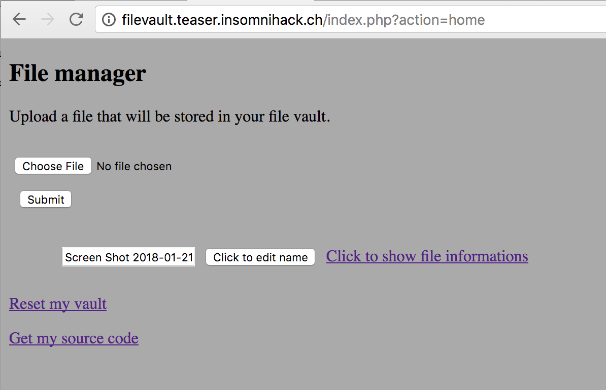

# Reference

[//]: <> (文章所涉及到的技术点、WriteUp的链接)

https://securimag.org/wp/challenges/writeup-insomnihack-teaser-2018-filevault/

http://corb3nik.github.io/blog/insomnihack-teaser-2018/file-vault

# Title

[//]: <> (题目)

You can securely store some of your files on our systems, and retrieve some data about them. We guarantee that all of your data are sure!

# Content

[//]: <> (WriteUp内容)

## The Challenge

File Vault is a sandboxed file manager allowing users to upload files and view file metadata. This challenge has been my favorite during the Insomnihack Teaser. Even if the source code was provided, this challenge showed a lot of originality.

As mentionned above, the challenge author provided us with the source code of the application. A user has access to five actions :

* ```home``` (viewing the main page)
* ```upload``` (uploading a new file)
* ```changename``` (renaming an existing file)
* ```open``` (viewing the metadata of an existing file)
* ```reset``` (remove all files from the sandbox)



