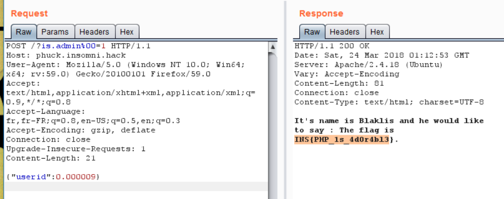

# Reference

[//]: <> (文章所涉及到的技术点、WriteUp的链接)

* https://tipi-hack.github.io/2018/03/25/insomni'hack-18-phuck.html
* https://blog.compass-security.com/2018/03/insomnihack-2018-phuck/

# Title

[//]: <> (题目)

A friend of me tell me that this script is a damn bad one in term of security. Can you explain me why?

# Content

[//]: <> (WriteUp内容)

Here is the PHP script:
```php
<?php
	$dataset = [
		0 => ['Blaklis', 'The flag is INS{snip}.'],
		1 => ['Lambda guy', 'We don\'t have anything interesting to say'],
		2 => ['Lambda guy 2', 'We still do not say anything interesting'],
		3 => ['Lambda guy 3', 'PHP is the best language ever!']
	];


	$block = (function($request) {
		$blocked = FALSE;
		$keywords = ['_', 'admin=', '\'', '"', '[', ']', '\\', " ", chr(9),chr(10),chr(11),chr(12),chr(13),chr(133),chr(160),"%"];
		foreach($keywords as $keyword)
			if(strpos(urldecode($request),$keyword) !== FALSE)
				$blocked = TRUE;
		return ($_SERVER['REMOTE_ADDR'] === '127.0.0.1') ? FALSE : $blocked;
	})($_SERVER['REQUEST_URI']);
	!$block?:die('Die by the WAF!');
	
	if($_SERVER['REQUEST_METHOD'] === 'POST' && $_GET['is_admin'] == 1) {
		$data = str_replace(" ","",file_get_contents("php://input"));
		$datablock = (function($post_data) {
			$blocked = (strlen($post_data) > 30 || !($a = json_decode($post_data)));
			return $blocked;
		})($data);
		!$datablock?:die('Die by the WAF!');
		$a = (array)json_decode($data);

		if(isset($a['userid']) && ($a['userid'] != 0 || $_SERVER['REMOTE_ADDR'] === '127.0.0.1')) {
			if(isset($dataset[$a['userid']])) {
				echo "It's name is ".$dataset[$a['userid']][0]." and he would like to say : ".$dataset[$a['userid']][1];
				exit;
			}
		}
	}

    die('Die by... nothing?');
```

## Challenge resolution

This challenge is not really complicated, but you need to know the dumb issues in PHP. So, to me, it was very frustrating!!

We can divide the PHP script in 2 parts.

## Keyword filtering

At the beginning, the script ensures that there is no specific keywords in the URL ```($_SERVER['REQUEST_URI'])``` such as ```_```, ```%``` and ```admin=```. The script is using ```strpos``` and ```urlencode``` functions. So we can’t use URL encoding to bypass the filter and since % character is filtered, we can’t use double URL encoding.

As you can see in the script, we need to have ```is_admin=1``` in the URL in order to go further but the filter is preventing that.

In order to bypass the admin= filter, we can use a NULL byte as follow: admin%00=.

But we are still stuck with the _ character. After many frustration and even thinking to find a way to fake my IP address to 127.0.0.1, I found the following PHP documentation:

http://nl1.php.net/manual/en/language.variables.external.php#language.variables.external.dot-in-names

So it appears that some characters such as (dot) or (space) are replace by _ (underscore) by PHP!!!!

```
For this reason, it is important to note that PHP will automatically replace any dots in incoming variable names with underscores. 

The full list of field-name characters that PHP converts to _ (underscore) is the following (not just dot):
chr(32) ( ) (space)
chr(46) (.) (dot)
chr(91) ([) (open square bracket)
chr(128) - chr(159) (various)

PHP irreversibly modifies field names containing these characters in an attempt to maintain compatibility with the deprecated register_globals feature.
```

## JSON decoding and userid

Then, if we found a way to bypass the filter function, the script checks if the ```is_admin``` parameter is set to 1 and the request is using a POST method. After, there is another check to ensure that the POST data is a valid JSON and the length is not longer than 30 characters. The final check is to ensure that the ```userid``` variable is present in the JSON data and its value is different 0.

So the question is how to have a value different to 0 but then when used as an index is equal to 0?

After trying some PHP juggling, I noticed that we just needed to give a float as ```userid``` value. Indeed, if we use 0.009 for instance. When the script will compare it, it will different from 0 because it’s not a strict comparison (```!=```).

## Putting All the pieces together

So at the end, we just need to send the following request, in order to obtain the flag!!!

