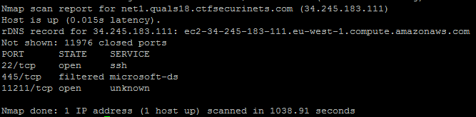

# Reference

[//]: <> (文章所涉及到的技术点、WriteUp的链接)

http://cherryblog.in/securinetsctf-quals-2018-write-up-hacking-competition/

# Title

[//]: <> (题目)

The Emperors wanted to hide their secret in a location where they can read it quickly, But they don't know anything about Security. Try to expose it: net1.quals18.ctfsecurinets.com


# Content

[//]: <> (WriteUp内容)


Points: 200

Category: Networking

Problem: The Emperors wanted to hide their secret in a location where they can read it quickly, But they don’t know anything about Security. Try to expose it: net1.quals18.ctfsecurinets.com
Category is networking it means ,may be we need to find where is service is hosted.When i opened net1.quals18.ctfsecurintes.com in browser ,it doesn’t show anything thats means service is not hosted at port 80 so lets find all the ports by nmap.
```
nmap net1.quals18.ctfsecurinets.com -p 1-20000
```



what is that unknown service hosted at port no. 112111.

Let’s try to netcat it:

```
netcat net1.quals18.ctfsecurinets.com 11211
```

No output.After Googling something i found that Memcached is a cache service which listen on that port. And knowing that the title of the task is Service Hidden in the bush, we can understand that “hidden” means “caching”. So maybe we can ignore that microsoft-ds service actually.

Let’s try to dump the 100 first keys:
```
stats cachedump 1 100
```
Output :
```
ITEM flag [23 b; 1521997883 s]
END
```
Excellent ! Now let’s dump that flag item:
```
get flag
```
Output :
```
Flag{M3mc4cH3d_3xp0s3d}
END
```