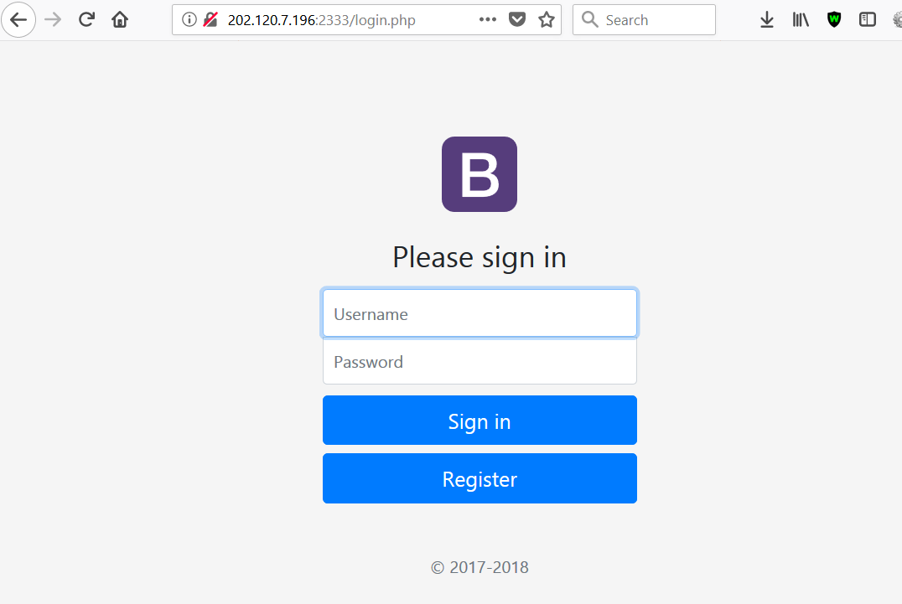
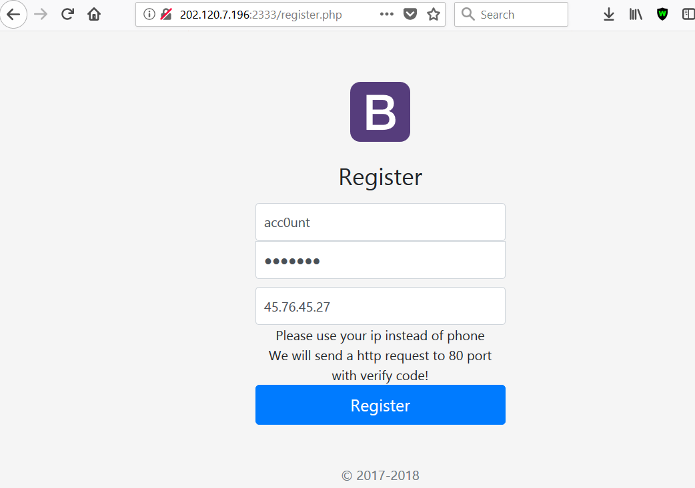
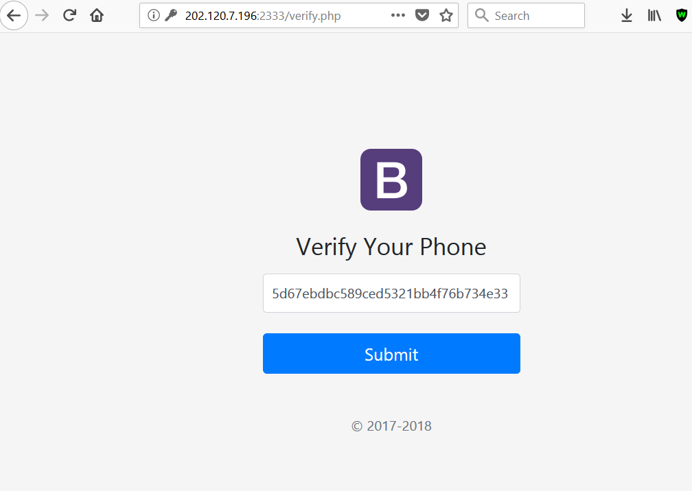
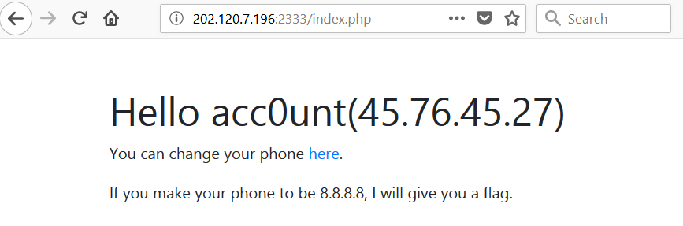
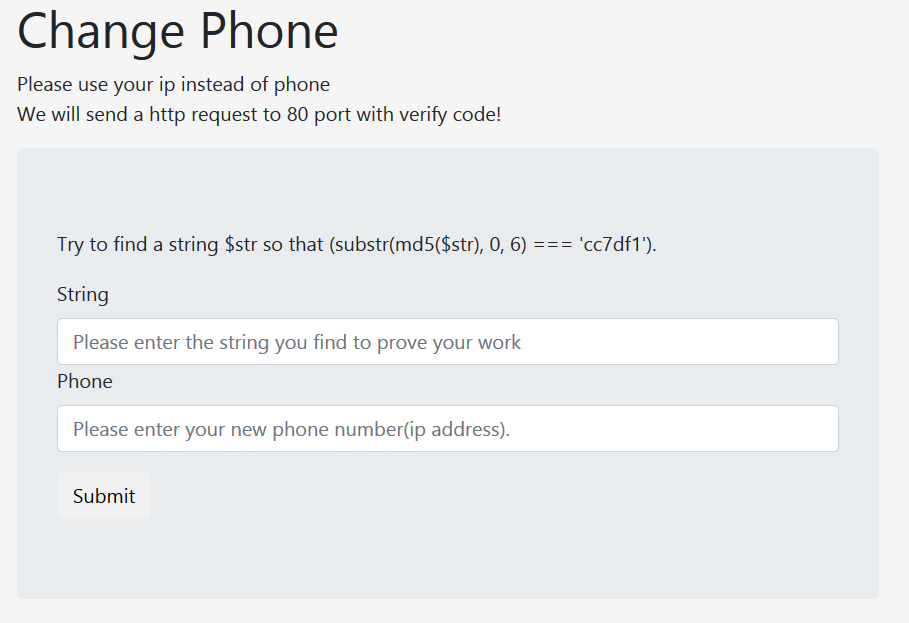
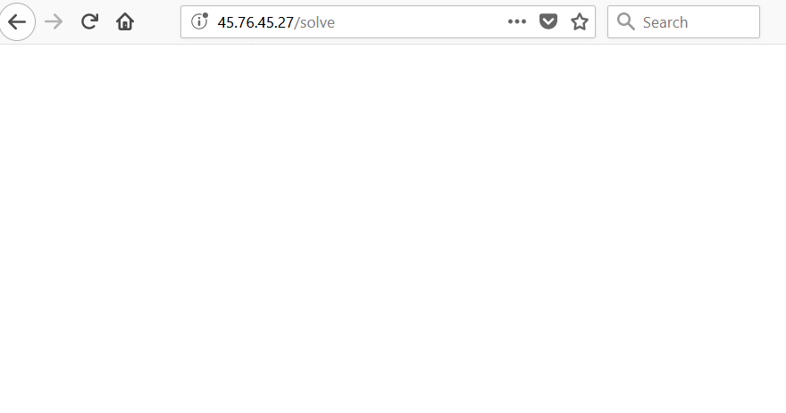
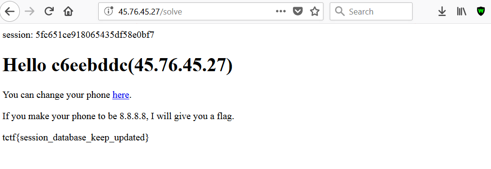

# Reference

[//]: <> (文章所涉及到的技术点、WriteUp的链接)

https://whit3hat.com/2018/04/05/0ps-ctf-easy-management-web/

# Title

[//]: <> (题目)

Welcome to the Easy UMS. http://202.120.7.196:2333/

Since you don't like the waf, port is changed to 2333.

You need bind your phone with exactly 8.8.8.8 to get flag.

# Content

[//]: <> (WriteUp内容)

I was given a web application without the source code. The task is to validate the ‘phone’ (IP) with 8.8.8.8 in order to obtain the flag.



When I register, I have to provide a username, password and phone, which is a controlled IP where I get a secret to confirm it.



I send the register request to the server and on my server I get the secret token to confirm the IP on port 80.

```
root@[REDACTED]:~# nc -nvlp 80
Listening on [0.0.0.0] (family 0, port 80)

Connection from 202.120.7.196 34302 received!

HEAD /?5d67ebdbc589ced5321bb4f76b734e33 HTTP/1.1

Host: 45.76.45.27

Accept: */*
```

The secret is ‘5d67ebdbc589ced5321bb4f76b734e33’ and I need this when I login for the first time, then I don’t need it anymore.



After the authentication I confirm the IP is mine and I go to the first page of the application.



On the first page I have, again, the description of the task. I have to change the phone number and make it 8.8.8.8 in order to get the flag.

So I go to ‘change.php’ page:



In this page I have a ‘ctf_captcha_style’ challenge. So I need an input that has md5 starting with ‘cc7df1’ and the phone number.

Obvious, I can’t confirm 8.8.8.8, because is not in our possession. First, I tried to confirm Command Injection, SQL Injection and some other related web application security problems and nothing worked.

After a while I came with the idea that it is possible to exploit a race condition on the second confirmation. I had to see how the request to ‘change.php’ script works. So, I tried manually and from burp I found out it takes 3 seconds and 400 miliseconds, maybe because the request of sending the secret has a 3 seconds timeout.

So, I assume that if I try to confirm ‘phone’ 8.8.8.8 with the secret previously taken from one of my IP and I send this secret in the same time when I initiate the change phone with 8.8.8.8 (we have 3 seconds), maybe I can take the flag.

Steps to get the flag:

1. First create 2 sessions for same account (authenticate 2 times and get PHPSESSID)
Go on the ‘change.php’ page and find a solution for the ‘captcha_md5’ for both sessions (sess1 and sess2).

1. First send the request to change phone with one of your IP and get the secret that was sent on port 80 from one of the sessions (sess1).

1. Create a python script that first sends the request to change phone number with 8.8.8.8 using the unused ‘sess2’ and in the same time (you have 3 seconds) validate, from ‘sess1’, your phone with the secret you previously taken.

1. Go on the first page on the first session and enjoy your flag.

I create a script that does all the work automatically. Run the python script (you need flask installed) .

```
root@[REDACTED]:/home/ctf/0ps2018/easymanagement# python solve.py
The secret will be sent at: 45.76.45.27

* Running on http://0.0.0.0:80/ (Press CTRL+C to quit)

84.117.79.176 – – [05/Apr/2018 04:51:26] “GET /solve HTTP/1.1” 200 –

202.120.7.196 – – [05/Apr/2018 04:51:26] “HEAD /?54b7d0c6b463443430536fd5f845238d HTTP/1.1” 200 –
```

Now go to your browser and visit “http://45.76.45.27/solve”, if there is no problems, the flag should appear in the same page.






The flag is tctf{session_database_keep_updated}.