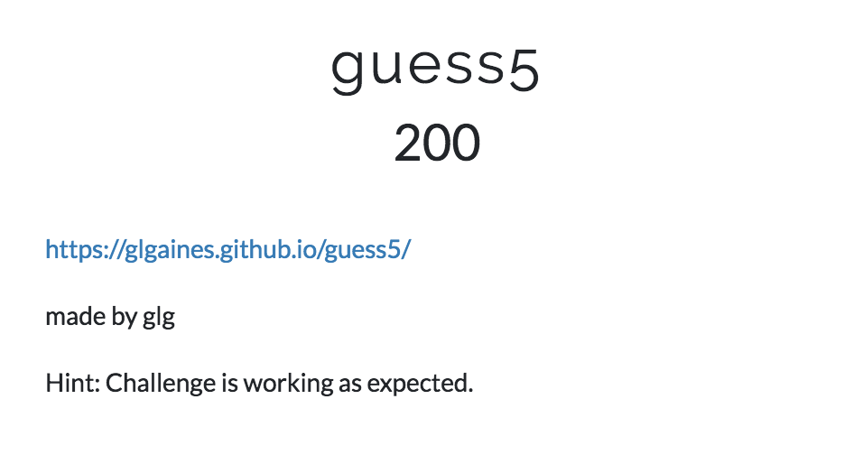
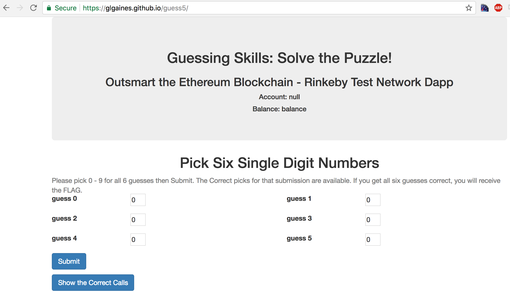
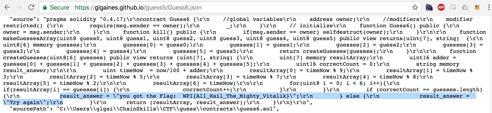

# Reference

[//]: <> (文章所涉及到的技术点、WriteUp的链接)

* https://ctftime.org/writeup/9731
* https://infosec.rm-it.de/2018/04/15/wpictf-2018-guess5/
* https://ctftime.org/writeup/9762

# Title

[//]: <> (题目)

# Content

[//]: <> (WriteUp内容)

The [WPICTF 2018](https://ctf.wpictf.xyz/) “guess5” challenge:

The URL presented us with a guessing game, we have to pick 6 numbers. If we picked the correct numbers we’ll get a flag:

However submitting our picks never worked. Investigating this for a bit it looks like this requires to run a local Ethereum node. Before trying to set that up we’ve looked more into what the web application does. Interestingly it fetches the URL https://glgaines.github.io/guess5/Guess6.json (mirror [here](https://infosec.rm-it.de/ctf/wpictf2018/guess5/Guess6.json)). In there we can find the ETH contract including in plain text for some reason. Which contains the flag:

The flag is: WPI{All_Hail_The_Mighty_Vitalik}