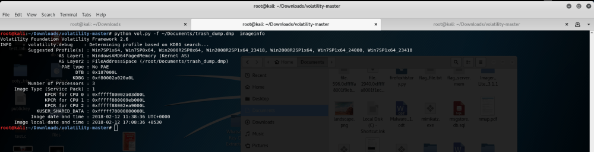
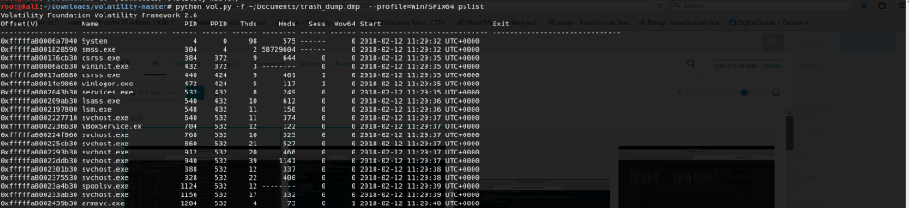
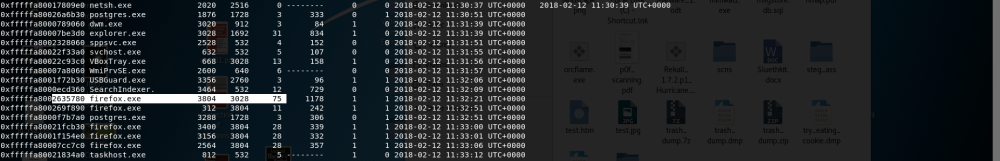
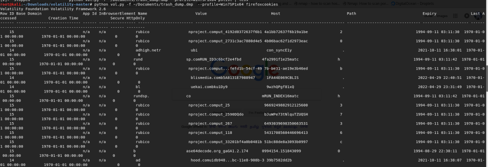
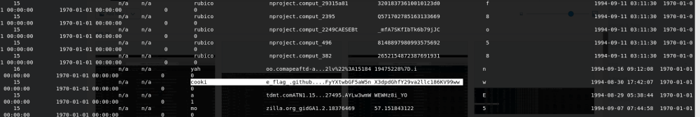
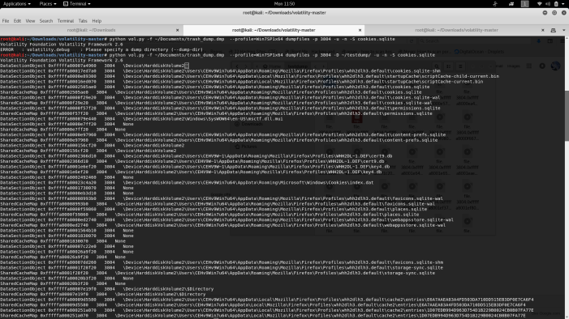
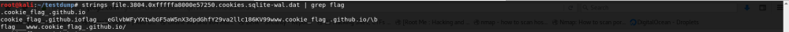

# Reference

[//]: <> (文章所涉及到的技术点、WriteUp的链接)

* https://naveenezioblog.wordpress.com/2018/02/26/trash_dump/

# Title

[//]: <> (题目)

Forensics Memory Dump.

# Content

[//]: <> (WriteUp内容)


The source for the trash_dump is given below.

https://github.com/NaveenEzio/xiomara2k18/tree/master/forensics/trashdump

## Step1:

Initially, for the given dump we have done a profile search for the memory dump using imageinfo plugin, then it shows what type of systems memory is that dump.

kdbgscan or imageinfo
```
$python vol.py -f ~/Documents/trash_dump.dmp imageinfo
```



## Step2:

Then check for the process pid’s in the dump using pslist, it shows someting like this.

check for the main pid of the running processes which you feel suspicious, here firefox looks very suspicious.

pslist
```
$python vol.py -f ~/Documents/trash_dump.dmp pslist
```




The firefox main pid process is 3804.

##Step:3

We checked if firefox has any cookies using firefoxcookies plugin.

Then we found a suspicious cookie that contains the flag data.


firefoxcookies
```
$python vol.py -f ~/Documents/trash_dump.dmp –profile=Win7SP1x64 firefoxcookies
```




## Step:4

Then dump the cookie database of the firefox process using the pid of the process and the dumpfiles plugin.


dump cookie database
```
$python vol.py -f ~/Documents/trash_dump.dmp –profile=Win7SP1x64 dumpfiles -p 3804 -D ~/testdump/ -u -n -S cookies.sqlite
```


after dumping the files of the firefox with its pid , all the files related to firefox will be dumped.

## Step:5

Do a xxd on cookies.sqlite.dat or strings to get the flg that is in the dat file


xxd on cookies.sqlite.dat file or just a strings command
```
$xxd file.3804.0xfffffa8000e57250.cookies.sqlite-wal.dat | grep flag
```


and we found that it is encrypted in base 64, so decrypt it using base 64 to get the decrypted original flag.

and the decrypted flag is

$echo eGlvbWFyYXtwbGF5aW5nX3dpdGhfY29va2llc186KV99 | base64 -d
xiomara{playing_with_cookies_:)_}